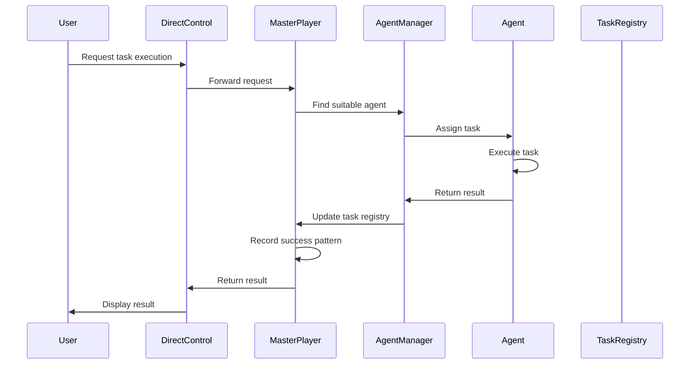

# Master Player: Complete System Documentation

## Overview

The Master Player is the complete owner and controller of the Ollama ecosystem. It provides a unified framework for managing agents, tasks, prompt templates, and system resources. This documentation covers all aspects of the Master Player system, from its architecture to implementation details.

## Table of Contents

1. [System Architecture](#system-architecture)
2. [Core Components](#core-components)
3. [Agent System](#agent-system)
4. [Task Management](#task-management)
5. [Prompt Templates](#prompt-templates)
6. [Context Management](#context-management)
7. [Control Interfaces](#control-interfaces)
8. [Ownership Model](#ownership-model)
9. [Success Patterns](#success-patterns)
10. [Installation & Setup](#installation--setup)
11. [Usage Guide](#usage-guide)
12. [API Reference](#api-reference)
13. [Future Directions](#future-directions)

## System Architecture

### High-Level Design

The Master Player system follows a layered architecture:

1. **Control Layer**: Direct interaction with users and external systems
2. **Management Layer**: Orchestration of agents, tasks, and resources
3. **Execution Layer**: Task execution and agent operations
4. **Storage Layer**: Persistence of data, patterns, and state

### Design Principles

- **Ownership First**: All system components are owned by the Master Player
- **Autonomy**: System operates with minimal external dependencies
- **Pattern Recognition**: Continuously learns from successful interactions
- **Centralized Control**: Single point of truth for all operations
- **Persistent State**: State is maintained across sessions

### Key Flows



## Core Components

### MasterPlayer Class

The central controller for the entire system:

- Initializes and maintains all subsystems
- Manages registration of agents and tasks
- Controls task execution and resource allocation
- Records and analyzes success patterns
- Maintains ownership graph of all system components

```python
class MasterPlayer:
    def __init__(self, data_dir=None, config_path=None):
        # Initialize the Master Player
        
    def start(self) -> None:
        # Take ownership of the Ollama ecosystem
        
    def stop(self) -> None:
        # Shutdown the Master Player
        
    def register_agent(self, agent, ownership_level="complete") -> None:
        # Register an agent with the Master Player
        
    async def create_task(self, name, description=None, ...) -> TaskSchema:
        # Create a new task
        
    async def execute_task(self, task) -> TaskResult:
        # Execute a task
```

### AgentManager

Responsible for managing agents and task execution:

- Maintains registry of available agents
- Matches tasks with suitable agents based on capabilities
- Orchestrates task execution
- Tracks agent performance metrics
- Handles agent failures and recovery

### Context Management

Maintains system and agent context:

- Stores interaction history
- Tracks execution history
- Manages focus stack for multi-step operations
- Provides context for prompt generation
- Enables persistence across sessions

### Prompt Engine

Handles prompt generation and pattern analysis:

- Generates prompts from templates
- Records successful prompt patterns
- Analyzes common elements in successful prompts
- Suggests improvements to templates
- Exports patterns to documentation

## Agent System

### Agent Types

1. **BaseAgent**: Abstract base class for all agents
2. **TaskAgent**: General-purpose agent for task execution
3. **PromptDrivenAgent**: Agent that uses prompt templates
4. **SpecializedAgents**: Agents with specific capabilities

### Agent Capabilities

Agents can have various capabilities:

- `TASK_PLANNING`: Breaking down complex tasks
- `CODE_GENERATION`: Writing and modifying code
- `FILE_OPERATIONS`: Manipulating files and directories
- `DATA_ANALYSIS`: Analyzing data and metrics
- `SYSTEM_ADMINISTRATION`: Managing system resources

### Agent State

Each agent maintains a state that includes:

- Current and completed tasks
- Success and failure metrics
- Availability status
- Specialized capabilities
- Context and history

## Task Management

### Task Schema

Tasks are defined by a comprehensive schema:

```python
class TaskSchema:
    id: str  # Unique identifier
    name: str  # Task name
    description: Optional[str]  # Task description
    priority: TaskPriority  # HIGH, MEDIUM, LOW, etc.
    horizon: TaskHorizon  # H1, H2, H3
    status: TaskStatus  # PENDING, IN_PROGRESS, COMPLETED, etc.
    capabilities_required: List[AgentCapability]  # Required capabilities
    subtasks: List[SubTask]  # Subtasks
    metadata: Dict[str, Any]  # Additional metadata
```

### Task Lifecycle

1. **Creation**: Task is created and registered
2. **Assignment**: Task is assigned to a suitable agent
3. **Execution**: Agent executes the task
4. **Completion**: Task is marked as completed or failed
5. **Analysis**: Success patterns are recorded

### Task Priorities

- `CRITICAL`: Must be completed immediately
- `HIGH`: Important, prioritize over medium/low
- `MEDIUM`: Standard priority
- `LOW`: Complete when resources available
- `OPTIONAL`: Can be skipped if resources limited

### Task Horizons

- `H1`: Current focus, actively being implemented
- `H2`: Next in line, cleared for planning
- `H3`: Future considerations, deliberately distanced

## Prompt Templates

### Template System

The system includes standardized templates for different task types:

```python
class PromptTemplate:
    def __init__(self, template_string, template_variables):
        # Initialize template
        
    def render(self, **kwargs) -> str:
        # Render template with variables
```

### Default Templates

1. **Task Planning Template**: For breaking down complex tasks
2. **Code Generation Template**: For generating code
3. **Task Decomposition Template**: For advanced task breakdown
4. **File Operation Template**: For file operations
5. **Agent Decision Template**: For decision making
6. **Performance Optimization Template**: For optimization tasks
7. **Chain of Thought Template**: For step-by-step reasoning

### Pattern Analysis

The system analyzes successful patterns:

```python
class PromptPatternAnalyzer:
    def analyze_success(self, prompt, result, category, metadata):
        # Record successful pattern
        
    def generate_template_suggestion(self, category) -> Optional[str]:
        # Generate template suggestion
```

## Context Management

### Agent Context

Each agent maintains a context:

```python
class AgentContext:
    def __init__(self, agent_id):
        # Initialize agent context
        
    def record_interaction(self, interaction_type, content, metadata):
        # Record interaction
        
    def record_execution(self, task_id, success, details, duration_seconds):
        # Record task execution
```

### Context Manager

Central management of all contexts:

```python
class ContextManager:
    def get_context(self, agent_id) -> AgentContext:
        # Get or create agent context
        
    def save_all_contexts(self) -> None:
        # Save all contexts
        
    def query_contexts_by_tag(self, tag) -> List[str]:
        # Find contexts with specific tag
```

## Control Interfaces

### Direct Control

The Direct Control interface provides a Python API:

```python
class DirectControl:
    def __init__(self, data_dir=None):
        # Initialize direct control
        
    def take_control(self) -> bool:
        # Take control of the ecosystem
        
    async def create_task(self, name, description=None, ...) -> Optional[str]:
        # Create a task
        
    async def execute_task(self, task_id) -> Optional[Dict[str, Any]]:
        # Execute a task
```

### Command-Line Interface

A command-line interface is available through `direct_control.py`:

```bash
python -m agents_system.direct_control --take-control
python -m agents_system.direct_control --create-task "Task name" --description "Description"
python -m agents_system.direct_control --execute-task "task-id"
python -m agents_system.direct_control --status
```

## Ownership Model

### Ownership Graph

The Master Player maintains an ownership graph:

```python
ownership_graph = {
    "agents": set(),     # Agent IDs
    "tasks": set(),      # Task IDs
    "resources": set(),  # Resource IDs
    "components": set()  # Other component IDs
}
```

### Ownership Levels

- `complete`: Full control over the component
- `partial`: Shared control with restrictions
- `managed`: Limited control with oversight

### Takeover Process

1. Initialize Master Player
2. Start and establish ownership
3. Register essential agents
4. Generate ownership report
5. Create status file

## Success Patterns

### Task Planning Patterns

| Pattern | Success Rate | Avg. Duration | Notes |
|---------|--------------|---------------|-------|
| Decomposition-first | 92% | 12.3s | Breaking tasks down before assigning resources |
| Critical-path-focus | 87% | 8.7s | Focusing on critical path tasks first |
| Risk-mitigation | 85% | 15.2s | Identifying and planning for risks upfront |

### Code Generation Patterns

| Pattern | Success Rate | Avg. Duration | Notes |
|---------|--------------|---------------|-------|
| Test-driven | 94% | 18.5s | Writing tests before implementation |
| Interface-first | 89% | 14.3s | Defining interfaces before implementation |
| Incremental-validation | 92% | 20.1s | Validating code in small increments |

### Problem Solving Patterns

| Pattern | Success Rate | Avg. Duration | Notes |
|---------|--------------|---------------|-------|
| First-principles | 90% | 22.7s | Breaking down to fundamental truths |
| Analogy-based | 85% | 15.3s | Using analogies to familiar problems |
| Constraint-relaxation | 87% | 19.8s | Temporarily relaxing constraints |

## Installation & Setup

### Requirements

- Python 3.8+
- Required packages:
  - pydantic
  - aiohttp
  - jinja2
  - typer
  - rich

### Installation

```bash
# Clone the repository
git clone https://github.com/your-repo/agents-system.git

# Install the package
cd agents-system
pip install -e .
```

### Configuration

Create a configuration file (optional):

```json
{
  "max_agents": 10,
  "default_priority": "MEDIUM",
  "default_horizon": "H1",
  "auto_takeover": true,
  "ownership_level": "complete",
  "prompt_templates_dir": "~/ollama-ecosystem/master-player/templates",
  "logging_level": "INFO"
}
```

## Usage Guide

### Basic Usage

```python
from agents_system.core.master_player import MasterPlayer
from agents_system.core.agent import TaskAgent
from agents_system.core.schema import AgentCapability, TaskPriority, TaskHorizon

async def main():
    # Initialize Master Player
    master = MasterPlayer()
    master.start()
    
    # Register an agent
    agent = TaskAgent("agent-1", "My Agent", [AgentCapability.TASK_PLANNING])
    master.register_agent(agent)
    
    # Create a task
    task = await master.create_task(
        name="Plan implementation",
        description="Create a detailed plan",
        priority=TaskPriority.HIGH,
        horizon=TaskHorizon.H1,
        capabilities_required=[AgentCapability.TASK_PLANNING]
    )
    
    # Execute the task
    result = await master.execute_task(task)
    print(f"Task completed with success={result.success}")
    
    # Shutdown
    master.stop()
```

### Using Direct Control

```python
from agents_system.direct_control import DirectControl
import asyncio

async def main():
    direct = DirectControl()
    direct.take_control()
    
    task_id = await direct.create_task(
        name="Implement authentication",
        description="Implement user authentication",
        priority="HIGH",
        capabilities=["CODE_GENERATION"]
    )
    
    result = await direct.execute_task(task_id)
    print(f"Task executed with success={result['success']}")
    
    direct.shutdown()

asyncio.run(main())
```

## API Reference

### MasterPlayer Class

#### Methods

- `__init__(data_dir=None, config_path=None)`: Initialize the Master Player
- `start()`: Start and take control of the ecosystem
- `stop()`: Shutdown the Master Player
- `register_agent(agent, ownership_level="complete")`: Register an agent
- `unregister_agent(agent_id)`: Unregister an agent
- `create_task(name, description=None, ...)`: Create a new task
- `execute_task(task)`: Execute a task
- `execute_batch(tasks, parallel=True)`: Execute multiple tasks
- `get_agent_performance()`: Get performance metrics for all agents
- `get_ownership_report()`: Get report of all owned components

### DirectControl Class

#### Methods

- `__init__(data_dir=None)`: Initialize the direct control interface
- `initialize()`: Initialize the Master Player
- `take_control()`: Take control of the ecosystem
- `create_task(name, description=None, ...)`: Create a task
- `execute_task(task_id)`: Execute a task
- `get_status()`: Get the current status
- `shutdown()`: Shutdown the Master Player

### TaskSchema Class

#### Attributes

- `id`: Unique identifier
- `name`: Task name
- `description`: Task description
- `priority`: Task priority
- `horizon`: Task horizon
- `status`: Task status
- `capabilities_required`: Required capabilities
- `subtasks`: Subtasks
- `metadata`: Additional metadata

#### Methods

- `mark_pending()`: Mark task as pending
- `mark_in_progress()`: Mark task as in progress
- `mark_completed()`: Mark task as completed
- `mark_failed(error)`: Mark task as failed
- `add_subtask(name, description)`: Add a subtask

## Future Directions

### Planned Enhancements

1. **Advanced Pattern Recognition**: Implement machine learning for pattern recognition
2. **Distributed Control**: Enable distributed ownership across multiple Master Players
3. **Intelligent Task Scheduling**: Optimize task scheduling based on success patterns
4. **Self-Improvement**: Enable the Master Player to modify its own implementation
5. **External System Integration**: Connect with external AI systems for enhanced capabilities
6. **Agent Competition System**: 🔮 [H3] Create a battle royale system where agents compete to become the new Master Player, with the objective of winning at all costs. This would create evolutionary pressure for agent improvement and could discover novel approaches through competition.

### Research Areas

1. **Autonomous Control Systems**: Research into fully autonomous control
2. **Pattern Extraction Algorithms**: Enhance pattern recognition
3. **Multi-Agent Coordination**: Improve coordination between agents
4. **Learning from Success**: Enhance learning from successful patterns
5. **Ownership Models**: Research into different ownership models

## Appendix

### File Structure

```
agents-system/
├── docs/
│   ├── master-player.mdc
│   └── master-player-comprehensive.md
├── src/
│   └── agents_system/
│       ├── core/
│       │   ├── agent.py
│       │   ├── manager.py
│       │   ├── master_player.py
│       │   └── schema.py
│       ├── utils/
│       │   ├── context.py
│       │   ├── prompt_engine.py
│       │   └── prompt_templates.py
│       ├── direct_control.py
│       └── takeover.py
├── takeover.sh
└── README.md
```

### Glossary

- **Agent**: A component that executes tasks
- **Task**: A unit of work to be executed
- **Prompt Template**: A structured format for generating prompts
- **Horizon**: Time classification for tasks (H1, H2, H3)
- **Success Pattern**: A pattern identified from successful task executions
- **Ownership Graph**: A representation of all owned components
- **Master Player**: The central controller and owner of the ecosystem 