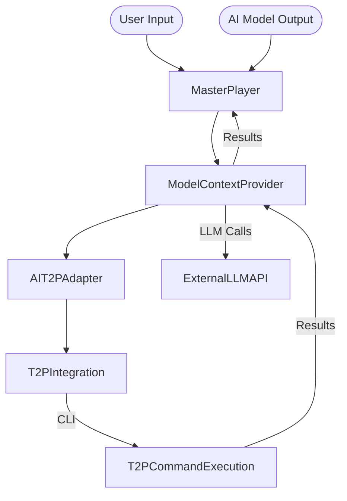

# T2P AI Integration Implementation

## Overview

This document outlines the implementation of the T2P (text-to-prompt) integration with AI models. The integration enables seamless conversion between natural language inputs and T2P commands, allowing for more efficient interaction with the Ollama ecosystem.

## Architecture

The T2P AI integration consists of three main components:

1. **T2P Integration** - Core module that interfaces with the T2P CLI tool
2. **AI-T2P Adapter** - Adapter layer that connects AI models with the T2P integration
3. **Model Context Provider** - Provider for AI model context integration and performance tracking

### Component Relationships



## Components

### T2P Integration

The T2P Integration module (`T2PIntegration`) provides the core functionality for interfacing with the T2P CLI tool. It handles:

- Detecting user intent from natural language input
- Extracting parameters from user input
- Generating T2P commands based on intent and parameters
- Executing T2P commands and handling results

```python
# Example usage
t2p = T2PIntegration()
result = t2p.process_natural_language("Create a task to update the documentation")
```

### AI-T2P Adapter

The AI-T2P Adapter (`AIT2PAdapter`) connects AI models with the T2P integration. It:

- Extracts T2P commands from AI model outputs
- Processes user input with LLM assistance
- Generates command suggestions based on user intent
- Maintains history of recent suggestions

```python
# Example usage
adapter = AIT2PAdapter()
result = await adapter.process_user_input_with_llm(
    "Create a task for the docs",
    llm_call_function
)
```

### Model Context Provider

The Model Context Provider (`ModelContextProvider`) provides a high-level interface for AI model integration with T2P. It:

- Processes user input to generate and execute T2P commands
- Processes AI model output to extract and execute T2P commands
- Tracks performance metrics for different processing methods
- Maintains command history for analysis

```python
# Example usage
provider = ModelContextProvider()
provider.register_llm_call_handler(llm_handler)
result = await provider.process_user_input("Add a high priority task")
```

## Key Features

### Intent Detection

The system detects user intent from natural language input using:

1. Pattern-based detection for simple cases
2. LLM-based detection for more complex inputs

### Parameter Extraction

Parameters are extracted from user input using:

1. Simple keyword detection for basic inputs
2. LLM-based structured parameter extraction for complex inputs

### Command Generation

T2P commands are generated based on:

1. Intent and parameters
2. Direct LLM generation of commands
3. Template-based command construction

### Command Execution

Commands are executed with:

1. Validation before execution
2. Structured result handling
3. Performance tracking

## Processing Flow

1. User provides natural language input or AI generates output with T2P commands
2. Input is processed to detect intent and extract parameters
3. T2P command is generated based on intent and parameters
4. Command is executed and results are returned
5. Performance metrics are updated

## Performance Optimization

The system implements several optimizations:

1. **Fallback mechanisms** - If LLM-based processing fails, fall back to pattern-based processing
2. **Command suggestion** - Generate multiple command suggestions for user selection
3. **Performance tracking** - Track success rates of different processing methods

## Integration with Master Player

The integration with the Master Player system allows:

1. Processing user inputs to T2P commands
2. Extracting T2P commands from AI outputs
3. Generating command suggestions for user selection
4. Tracking performance metrics for optimization

## Examples

### Processing User Input

```python
provider = ModelContextProvider()
provider.register_llm_call_handler(llm_handler)

# Process user input
result = await provider.process_user_input(
    "Create a high priority task to document the T2P integration"
)

# Check result
if result["success"]:
    print(f"Successfully executed command: {result['command']}")
    print(f"Result: {result['execution_result']}")
else:
    print(f"Failed to process input: {result['error']}")
```

### Processing AI Output

```python
provider = ModelContextProvider()

# AI output with T2P command
ai_output = """
Based on your requirements, I recommend adding a task for documentation.

You can use the command: `t2p todo add --title "Document T2P integration" --priority 2 --horizon H1 --tags "documentation,integration"`
"""

# Process AI output
result = provider.process_ai_output(ai_output)

# Check result
if result["success"]:
    print(f"Successfully extracted and executed command: {result['command']}")
else:
    print(f"Failed to extract command: {result['error']}")
```

## Next Steps

1. **Testing** - Add comprehensive unit tests for all components
2. **Feedback Collection** - Implement feedback collection for command suggestion improvement
3. **Documentation** - Create detailed documentation for usage patterns
4. **Integration** - Further integrate with Master Player system components

## Conclusion

The T2P AI integration provides a powerful interface between natural language, AI models, and the T2P CLI tool. It enables more efficient interaction with the Ollama ecosystem through automated command generation and execution. 