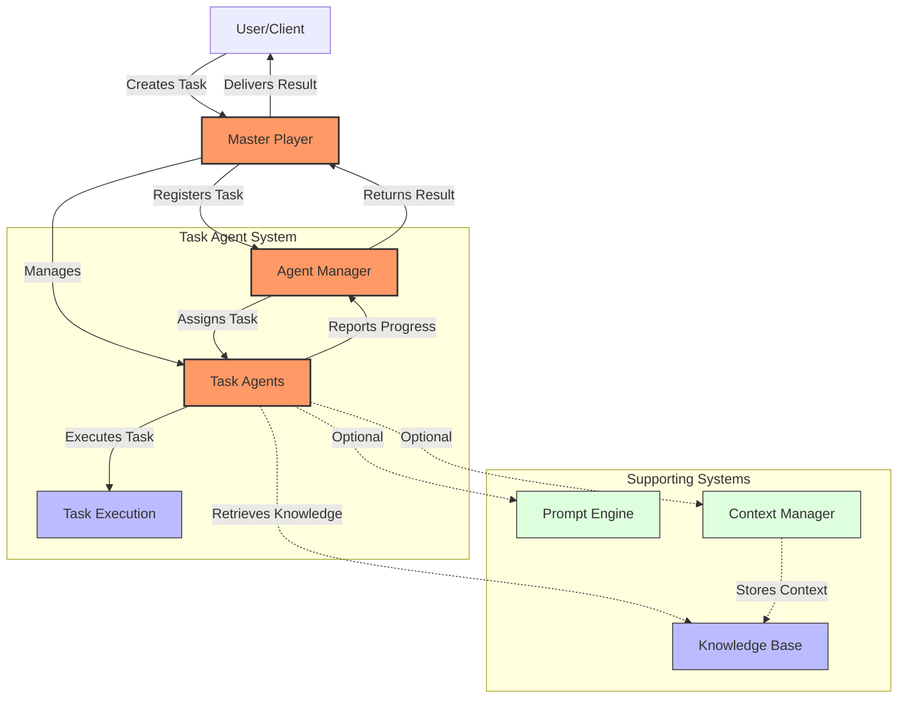
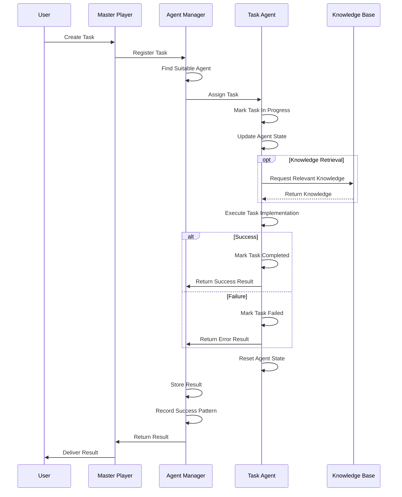
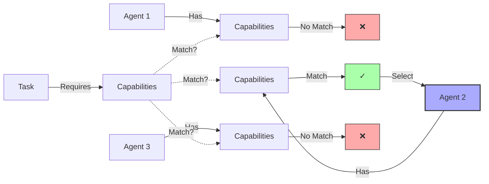
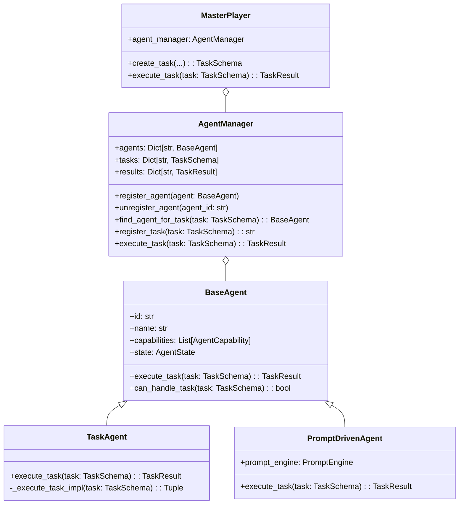

# Task Agent Architecture

This document provides a visual representation of the Task Agent architecture and workflow within the Ollama ecosystem.

## System Architecture

## Task Execution Workflow

## Agent Capability Matching

## Component Hierarchy

These diagrams illustrate:
1. The overall system architecture showing how components interact
2. The sequence of events during task execution 
3. How agent capabilities are matched to tasks
4. The class hierarchy and relationships between components

The Task Agent system provides a flexible framework for executing a wide variety of tasks, with each agent specialized for particular capabilities. 