# Codebase Organization & Development Mindmap

## 1. Knowledge Graph Structure 🧠

```mermaid
mindmap
  root((OSPAiN2 Hub))
    [Components]
      UI Components
        Design System
        Visualization Tools
        Interactive Elements
      Knowledge Graph
        Semantic Analysis
        Context Management
        Relationship Tracking
      Agent System
        Workflow Management
        Task Orchestration
        Communication Layer
    [Infrastructure]
      Local-First Systems
        Model Serving
        Cache Management
        Resource Optimization
      Integration Layer
        API Management
        Data Synchronization
        Security Controls
    [Development Modes]
      Design Mode 🎨
        UI/UX Development
        Component Architecture
        Visual Systems
      Engineering Mode 🔧
        Core Functionality
        System Integration
        Performance Optimization
      Testing Mode 🧪
        Quality Assurance
        Performance Testing
        Security Validation
      Deployment Mode 📦
        Release Management
        Documentation
        Monitoring Setup
      Maintenance Mode 🔍
        System Health
        Updates
        Support
```


## 2. Implementation Strategy

### Phase 1: Foundation Strengthening
```typescript
interface FoundationPhase {
  priorities: [
    'Knowledge Graph Optimization',
    'Component Library Completion',
    'Infrastructure Hardening'
  ];
  metrics: {
    knowledgeGraphCoverage: number;
    componentCompletion: number;
    systemStability: number;
  };
}
```

#### Action Items:
1. Complete UI Component Library (Currently 60% complete)
2. Optimize Knowledge Graph Integration
3. Strengthen Local-First Infrastructure

### Phase 2: System Integration
```typescript
interface IntegrationPhase {
  focus: [
    'Agent System Integration',
    'Workflow Automation',
    'Cross-Component Communication'
  ];
  deliverables: {
    agentSystem: 'Fully Integrated Agent Framework';
    workflows: 'Automated Development Workflows';
    communication: 'Robust Inter-Component Messaging';
  };
}
```

#### Action Items:
1. Implement Agent Communication System
2. Develop Workflow Automation Tools
3. Create Cross-Component Event System

### Phase 3: Performance Optimization
```typescript
interface OptimizationPhase {
  targets: {
    response_time: '< 100ms';
    memory_usage: '< 500MB';
    cache_hit_rate: '> 95%';
  };
  strategies: [
    'Intelligent Caching',
    'Resource Management',
    'Load Distribution'
  ];
}
```

## 3. Development Workflow

### Current Progress Tracking
- UI Component Library: 60% Complete
  - ✅ Button, Card, Input, ErrorDisplay
  - ✅ Modal, Dropdown, Toast, Tabs
  - 🔄 In Progress: Breadcrumbs, Pagination
  - ⏳ Pending: Charts, Status Indicators

### Next Steps Sequence
1. **Scripts & Templates**
   - Create automation scripts
   - Develop reusable templates
   - Establish script testing framework

2. **Recursive Implementation**
   - Implement component patterns
   - Build system integrations
   - Develop testing frameworks

3. **Finalization**
   - Complete documentation
   - Perform system testing
   - Prepare deployment pipeline

4. **Full Functionality**
   - Enable all features
   - Verify integrations
   - Validate performance

## 4. Knowledge Graph Integration

### Current State
```typescript
interface KnowledgeGraphState {
  nodes: 248;
  relationships: 612;
  categories: {
    concepts: 86;
    tools: 42;
    files: 57;
    commands: 35;
    agents: 28;
  };
}
```

### Enhancement Strategy
1. **Semantic Analysis**
   - Implement advanced NLP processing
   - Enhance relationship detection
   - Improve context awareness

2. **Cache Optimization**
   - Implement multi-level caching
   - Optimize cache invalidation
   - Enhance query performance

## 5. Implementation Timeline

### Q2 2024
- Complete UI Component Library
- Optimize Knowledge Graph
- Implement Agent System

### Q3 2024
- Develop Workflow Automation
- Enhance Performance
- Complete Integration Testing

### Q4 2024
- Deploy Production Systems
- Implement Monitoring
- Begin Scale Testing

## 6. Success Metrics

### Technical Metrics
```typescript
interface SuccessMetrics {
  performance: {
    responseTime: '< 100ms';
    throughput: '> 1000 ops/sec';
    availability: '99.99%';
  };
  quality: {
    testCoverage: '> 90%';
    bugResolutionTime: '< 24h';
    codeQuality: '> 95%';
  };
  adoption: {
    userSatisfaction: '> 90%';
    featureUtilization: '> 80%';
    systemStability: '> 99%';
  };
}
```

## 7. Monitoring & Maintenance

### System Health Checks
- Performance Monitoring
- Error Tracking
- Resource Usage
- User Feedback

### Maintenance Schedule
- Daily: Automated Health Checks
- Weekly: Performance Review
- Monthly: System Updates
- Quarterly: Major Version Updates

## 8. Documentation Strategy

### Technical Documentation
- API Documentation
- Integration Guides
- Development Workflows
- Troubleshooting Guides

### User Documentation
- Feature Guides
- Best Practices
- Tutorial Videos
- FAQ System

---
Generated: April 2024
Version: 1.0
Classification: Internal - Strategic 