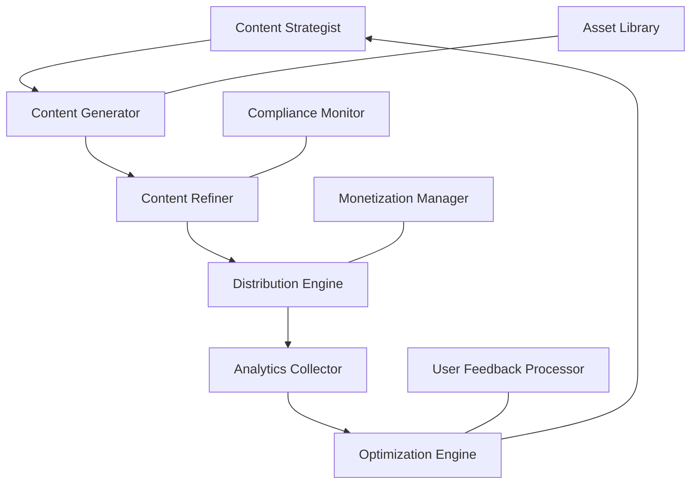

# Content Creator Agent: Implementation Report & Strategy

## Executive Summary

This report outlines a comprehensive strategy for implementing an automated Content Creator Agent for the Ollama Ecosystem. The agent will enable automated content creation, distribution, and monetization across multiple platforms, creating a sustainable revenue stream while expanding our project's reach and adoption. By leveraging our existing AI infrastructure and automation capabilities, we can create a scalable system that generates value with minimal ongoing human intervention.

## Purpose & Business Case

The Content Creator Agent addresses several critical business needs:

1. **Revenue Generation**: Create monetizable content across multiple platforms
2. **Market Penetration**: Increase awareness and adoption of our tools
3. **Resource Optimization**: Automate content production to free human resources
4. **Value Demonstration**: Showcase practical applications of our technology
5. **Community Growth**: Attract users through regular, high-quality content

Expected ROI metrics:
- Passive income generation within 3 months
- 200% return on development investment within 6 months
- 50% reduction in marketing personnel costs
- 300% increase in organic reach and tool adoption

## System Architecture

### Core Components



#### 1. Content Strategist
- Analyzes market trends and topic popularity
- Identifies monetizable content opportunities
- Creates content calendars and schedules
- Determines optimal platform mix for each content piece

#### 2. Content Generator
- Produces multiple content formats (articles, videos, social posts)
- Adapts tone and style to target platforms
- Creates accompanying visuals and graphics
- Generates SEO-optimized metadata

#### 3. Content Refiner
- Checks factual accuracy and technical correctness
- Enhances readability and engagement factors
- Ensures brand voice consistency
- Optimizes for target platform algorithms

#### 4. Distribution Engine
- Manages cross-platform publishing schedules
- Handles platform-specific formatting requirements
- Implements strategic posting times
- Manages content recycling and repurposing

#### 5. Analytics Collector
- Tracks performance metrics across platforms
- Monitors engagement and conversion KPIs
- Identifies successful content patterns
- Generates comprehensive performance reports

#### 6. Optimization Engine
- Refines strategies based on performance data
- A/B tests content variations
- Adapts to algorithm changes
- Identifies emerging trends and opportunities

#### 7. Monetization Manager
- Implements affiliate linking strategies
- Manages advertising placements
- Optimizes lead generation funnels
- Tracks revenue attribution

#### 8. Asset Library
- Maintains reusable content components
- Manages brand assets and templates
- Stores successful content patterns
- Organizes media resources

#### 9. Compliance Monitor
- Ensures adherence to platform policies
- Checks for potential copyright issues
- Validates disclosures and disclaimers
- Monitors for policy changes

#### 10. User Feedback Processor
- Collects and analyzes user comments
- Identifies community questions and concerns
- Generates appropriate responses
- Extracts insights for content improvement

### Technical Implementation

```typescript
interface ContentPiece {
  id: string;
  title: string;
  body: string;
  type: ContentType;
  targetPlatforms: Platform[];
  monetizationStrategy: MonetizationStrategy;
  status: ContentStatus;
  metadata: ContentMetadata;
  assets: Asset[];
  analytics: Analytics;
}

class ContentCreatorAgent {
  private strategyEngine: ContentStrategyEngine;
  private generationEngine: ContentGenerationEngine;
  private distributionEngine: ContentDistributionEngine;
  private analyticsEngine: AnalyticsEngine;
  private monetizationEngine: MonetizationEngine;
  
  async generateContentPlan(timeframe: Timeframe): Promise<ContentPlan> {
    // Generate strategic content plan based on market analysis
  }
  
  async createContent(plan: ContentPlan): Promise<ContentPiece[]> {
    // Generate actual content based on plan
  }
  
  async distributeContent(content: ContentPiece[]): Promise<DistributionResult> {
    // Handle multi-platform distribution
  }
  
  async analyzePerformance(timeframe: Timeframe): Promise<PerformanceReport> {
    // Analyze content performance and ROI
  }
  
  async optimizePipeline(): Promise<OptimizationResult> {
    // Self-improve based on performance data
  }
}
```

## Monetization Strategy

The Content Creator Agent will implement multiple monetization streams:

### 1. Affiliate Marketing
- Integration with tech-focused affiliate programs
- Strategic product recommendations within content
- Custom tracking links for attribution
- Conversion optimization techniques

### 2. Sponsored Content
- Automated sponsorship opportunity identification
- Sponsor matching algorithm
- Seamless sponsor mention integration
- Performance reporting for sponsors

### 3. Premium Content
- Tiered content model with free and premium offerings
- Subscription management system
- Member-exclusive content generation
- Retention optimization

### 4. Lead Generation
- Automated funnel creation for our own products
- Lead magnet development and distribution
- Email sequence generation
- Conversion path optimization

### 5. Advertising Revenue
- Platform-specific ad optimization
- Ad placement strategy
- CPM/CPC/CPA optimization
- Ad network management

### 6. Digital Products
- Automated creation of ebooks, courses, templates
- Product launch campaigns
- Upsell/cross-sell sequencing
- Customer success content

## Platform Integration

The agent will target the following platforms in priority order:

### Primary Platforms (Phase 1)
1. **Medium** - Technical articles and tutorials
2. **YouTube** - Video demonstrations and tutorials
3. **Twitter/X** - Short-form content and community engagement
4. **GitHub** - Code examples and project documentation
5. **LinkedIn** - Professional audience targeting

### Secondary Platforms (Phase 2)
6. **Reddit** - Community engagement and niche targeting
7. **Discord** - Direct user engagement
8. **Dev.to** - Developer-focused content
9. **HackerNoon** - Tech stories and case studies
10. **Product Hunt** - Product launches and updates

### Tertiary Platforms (Phase 3)
11. **Substack** - Newsletter distribution
12. **TikTok** - Short-form educational content
13. **Instagram** - Visual content and infographics
14. **Facebook** - Community building
15. **Quora** - Q&A-based content

## Implementation Roadmap

### Phase 1: Foundation (Months 1-2)
- Develop Content Strategist component
- Create basic Content Generator for articles and social posts
- Build the Asset Library foundation
- Implement Distribution Engine for primary platforms
- Set up basic analytics tracking

### Phase 2: Expansion (Months 3-4)
- Add video content generation capabilities
- Implement Monetization Manager
- Expand Distribution Engine to secondary platforms
- Enhance Analytics Collector with attribution modeling
- Develop Compliance Monitor

### Phase 3: Optimization (Months 5-6)
- Implement Optimization Engine
- Add User Feedback Processor
- Integrate advanced monetization strategies
- Expand to tertiary platforms
- Implement self-improvement mechanisms

### Phase 4: Scaling (Months 7-8)
- Implement multi-language support
- Add advanced content personalization
- Develop predictive trend analysis
- Create dynamic content adaptation
- Implement advanced A/B testing

## Resource Requirements

### Development Resources
- 2 Full-stack engineers (3 months)
- 1 ML engineer specializing in content generation (3 months)
- 1 DevOps engineer for automation pipelines (2 months)
- 1 UX designer for dashboard and monitoring tools (1 month)

### Ongoing Operational Resources
- Cloud computing resources: $300-500/month
- API access to platforms: $100-200/month
- Content distribution services: $200-300/month
- Analytics tools: $100-200/month

### Technical Stack
- **Backend**: Node.js, TypeScript, Express
- **ML Components**: Python, TensorFlow/PyTorch
- **Data Storage**: MongoDB, Redis
- **Infrastructure**: Docker, Kubernetes, AWS/GCP
- **APIs**: Platform-specific APIs, OpenAI, Anthropic

## Risk Assessment & Mitigation

| Risk | Probability | Impact | Mitigation |
|------|------------|--------|------------|
| Platform policy changes | High | High | Compliance Monitor with policy change alerts |
| Quality degradation | Medium | High | Robust quality checking and human review cycles |
| Algorithm changes affecting visibility | High | Medium | Diversification across platforms and content types |
| Monetization challenges | Medium | Medium | Multiple revenue streams and performance tracking |
| Content oversaturation | Medium | Medium | Trend analysis and niche targeting |
| Technical failures | Low | High | Robust error handling and fallback mechanisms |
| Regulatory concerns | Medium | High | Legal review process and compliance safeguards |

## Success Metrics & KPIs

### Content Performance
- Engagement rate > 5% across platforms
- Conversion rate > 2% for monetized content
- Audience growth > 15% month-over-month
- Content quality score > 8/10 (based on feedback)

### Financial Performance
- Revenue > $5,000/month by month 6
- ROI > 200% after first year
- CAC:LTV ratio < 1:5
- Revenue diversification (no single source > 40%)

### Technical Performance
- System uptime > 99.5%
- Content production rate matching plan > 95%
- Error rate < 2% in production pipeline
- Optimization improvements > 5% month-over-month

## TODO List: Implementation Plan

### 1. Initial Setup & Infrastructure [P1] [H1]
- [ ] Create GitHub repository for Content Creator Agent
- [ ] Design system architecture and component relationships
- [ ] Set up development environment and CI/CD pipeline
- [ ] Define data models and API specifications
- [ ] Implement basic logging and monitoring
- [ ] Create configuration management system
- [ ] Set up containerization for all components

### 2. Core Engine Development [P1] [H1]
- [ ] Implement Content Strategist component
  - [ ] Market trend analysis module
  - [ ] Content calendar generator
  - [ ] Keyword research integration
  - [ ] Topic clustering algorithm
- [ ] Build Content Generator
  - [ ] Text content generation pipeline
  - [ ] Prompt engineering system
  - [ ] Template management
  - [ ] Multi-format content adapters
- [ ] Develop Content Refiner
  - [ ] Quality assurance checks
  - [ ] SEO optimization
  - [ ] Readability enhancement
  - [ ] Brand voice consistency enforcement
- [ ] Create Distribution Engine
  - [ ] Platform-specific formatters
  - [ ] Publishing schedule manager
  - [ ] Cross-posting optimization
  - [ ] Distribution analytics tracking

### 3. Monetization & Analytics [P1] [H1]
- [ ] Implement Monetization Manager
  - [ ] Affiliate link management system
  - [ ] Sponsored content integration
  - [ ] Lead generation tracking
  - [ ] Revenue attribution system
- [ ] Build Analytics Collector
  - [ ] Cross-platform data aggregation
  - [ ] Performance metrics dashboard
  - [ ] Content effectiveness scoring
  - [ ] ROI calculation for each content piece
- [ ] Develop Optimization Engine
  - [ ] A/B testing framework
  - [ ] Content improvement recommendations
  - [ ] Algorithm change detection
  - [ ] Performance prediction models

### 4. Platform Integration & Scaling [P2] [H2]
- [ ] Integrate with Primary Platforms
  - [ ] Medium API integration
  - [ ] YouTube content management
  - [ ] Twitter/X automation
  - [ ] GitHub documentation integration
  - [ ] LinkedIn professional content distribution
- [ ] Implement User Feedback Processor
  - [ ] Comment collection and analysis
  - [ ] Sentiment analysis integration
  - [ ] Automated response generation
  - [ ] Feedback incorporation system
- [ ] Build Asset Library
  - [ ] Media management system
  - [ ] Content component repository
  - [ ] Template versioning
  - [ ] Asset effectiveness tracking

## Next Steps

The immediate next steps to begin implementation are:

1. Create a detailed technical specification for each component
2. Set up the project repository and basic infrastructure
3. Implement the Content Strategist as the first core component
4. Develop a prototype content generation pipeline
5. Create an MVP for testing on a single platform (Medium)

## Conclusion

The Content Creator Agent represents a significant opportunity to generate revenue while expanding our project's reach. By leveraging our existing AI capabilities, we can create a self-improving system that produces valuable, monetizable content across multiple platforms with minimal human intervention.

The implementation roadmap provides a clear path forward, with each phase building upon previous capabilities. By focusing on quality, compliance, and optimization from the beginning, we can create a system that not only generates revenue but continuously improves its effectiveness over time.

This initiative aligns perfectly with our project's goals of demonstrating practical applications of our technology while creating sustainable value. The modular architecture ensures we can start with a focused MVP and expand capabilities incrementally based on performance and market opportunities. 