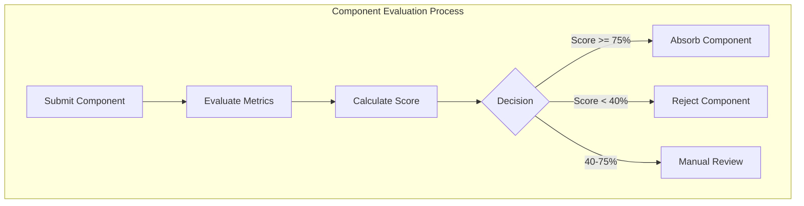

# Component Evaluation Framework

The Component Evaluation Framework provides a systematic approach for evaluating and absorbing external components into the OSPAiN2 ecosystem. This document outlines the metrics, evaluation process, and integration mechanisms.

## Overview

The Component Evaluation Framework enables teams to objectively assess external components for potential inclusion in the OSPAiN2 ecosystem. It uses a weighted scoring system based on multiple metrics across performance, quality, integration, user experience, and maintenance categories.



## Evaluation Metrics

Components are evaluated across five categories of metrics:

### Performance Metrics

- **Render Time**: Time to render component UI (lower is better)
- **Memory Usage**: Memory consumption during operation (lower is better)
- **Bundle Size**: Size impact on final bundle (lower is better)

### Quality Metrics

- **Code Quality**: Based on code standards, patterns, and practices
- **Accessibility**: Compliance with accessibility standards
- **Test Coverage**: Percentage of code covered by tests

### Integration Metrics

- **Dependency Count**: Number of external dependencies (lower is better)
- **Integration Effort**: Estimated work to integrate (lower is better)
- **Compatibility Score**: Compatibility with existing components

### User Experience Metrics

- **Usability Score**: Ease of use and intuitiveness
- **Interactivity Score**: Quality of interactive elements

### Maintenance Metrics

- **Documentation Quality**: Completeness and clarity of documentation
- **Maintainability Score**: Ease of maintaining and extending

## Scoring System

Each metric is normalized to a 0-1 scale and weighted according to importance. The final score determines the component's fate:

- **≥ 75%**: Automatically absorbed into the ecosystem
- **< 40%**: Automatically rejected
- **40-75%**: Requires manual review and decision

## Integration with OSPAiN2 Ecosystem

The Component Evaluation Framework integrates with other parts of the OSPAiN2 ecosystem:

- **OSPAiN2 Hub**: Central registry for evaluated components
- **Component Absorber**: Handles the technical integration of approved components
- **Development Workflow**: Used in the Engineering Mode for component assessment

## Usage in React Applications

The framework provides a React hook for evaluating components:

```typescript
// Example usage of the component evaluation hook
const { metrics, updateMetrics, status, evaluation, completeEvaluation } =
  useComponentEvaluation(
    "unique-component-id",
    "ComponentName",
    "https://github.com/source/repo",
    initialMetrics
  );

// Update metrics as you test the component
updateMetrics({
  renderTime: 25,
  memoryUsage: 15,
  codeQuality: 85,
});

// Complete the evaluation
const result = completeEvaluation(
  "Evaluator Name",
  "Component meets our needs for X functionality"
);
```

## Component Evaluation Registry

The framework maintains a registry of all evaluated components, allowing teams to:

- Track evaluation history
- Get statistics on absorption rates
- Find components with similar functionality
- Prevent duplicate evaluations

## Technical Implementation

The Component Evaluation Framework is implemented in TypeScript with React integration. Core components include:

- `calculateComponentScore`: Algorithm for scoring components
- `evaluateComponent`: Main evaluation function
- `useComponentEvaluation`: React hook for component evaluation
- `ComponentEvaluationRegistry`: Singleton for tracking evaluations

## Future Enhancements

Planned enhancements to the framework include:

- Automated metric collection through performance testing
- Integration with CI/CD pipelines
- Comparison views for similar components
- Historical trend analysis for component quality

## Related Documentation

- [Component Absorber](./component_absorber.md)
- [Development Workflow](./development_workflow.md)
- [OSPAiN2 Hub Architecture](./ospain2_hub_architecture.md)
