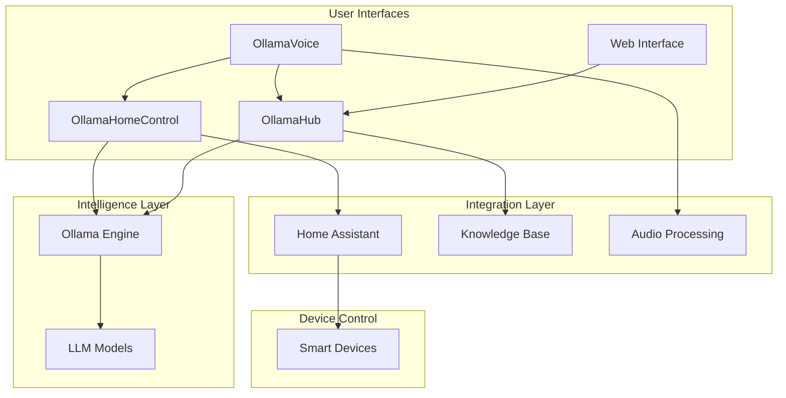

# Ollama Ecosystem Map

This document provides a visual and textual representation of all components within the Ollama ecosystem and their relationships.

## Core Components

## Application Ecosystem Relationships

### OllamaVoice
- **Role**: Provides voice-activated interface to the entire ecosystem
- **Dependencies**: Ollama API, Audio processing libraries
- **Outputs To**: OllamaHomeControl, OllamaHub
- **Integration Points**: Voice command translation, speech synthesis

### OllamaHomeControl
- **Role**: Manages smart home devices through natural language
- **Dependencies**: Ollama API, Home Assistant API
- **Outputs To**: Home Assistant
- **Integration Points**: Device control requests, state monitoring, automation creation

### OllamaHub
- **Role**: Central knowledge management system
- **Dependencies**: Ollama API, Vector database
- **Outputs To**: All other applications
- **Integration Points**: Knowledge retrieval, document storage, cross-application memory

## Data Flow Overview

The ecosystem follows a standardized data flow pattern:

1. **User Input** → Voice or text commands enter the system
2. **Intent Recognition** → Ollama processes language to identify intent
3. **Routing** → Commands are routed to appropriate specialized application
4. **Execution** → Specialized app performs its function
5. **State Updates** → System state changes are propagated to relevant components
6. **Response Generation** → Results are processed into user-friendly responses
7. **Delivery** → Information is presented back to the user

## Expansion Points

The ecosystem is designed to be extended with new specialized applications:

- **OllamaInsights**: Data analysis and reporting
- **OllamaFlow**: Workflow automation
- **OllamaCLI**: Command line assistant

Each expansion follows the same integration patterns and adheres to the ecosystem principles. 