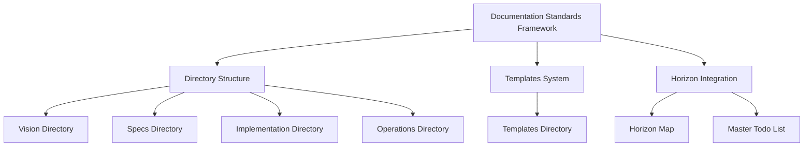
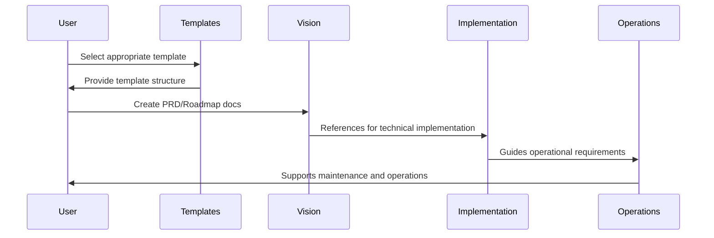

# Documentation Standards Framework - Technical Design Document

## Document Metadata

- **Status**: Approved
- **Author**: Claude 3.7 Sonnet
- **Last Updated**: 2024-06-28
- **Horizon**: H1
- **Development Mode**: 🔧 Engineering Mode
- **Related PRD**: [Documentation Standards PRD](../../vision/prd/documentation-standards-prd.md)

## Overview

This document details the technical implementation of the Documentation Standards Framework for the Ollama Ecosystem project. It covers the directory structure, template system, and integration with the horizon management framework.

## Architecture

### Component Diagram



### Data Flow

The documentation flow follows the development lifecycle:



## System Components

### Component 1: Directory Structure

- **Purpose**: Organize documentation in a logical, discoverable hierarchy
- **Interfaces**: File system paths and README.md navigation
- **Dependencies**: None
- **Implementation Details**:
  - Four main directories: vision, specs, implementation, operations
  - Each with subdirectories for specific document types
  - README.md files at each level to explain purpose and contents

### Component 2: Templates System

- **Purpose**: Provide standardized formats for all document types
- **Interfaces**: Markdown templates with placeholder text
- **Dependencies**: None
- **Implementation Details**:
  - Templates stored in templates/documentation directory
  - Each template has consistent metadata section
  - Instructions embedded as comments
  - README.md with usage guidelines

### Component 3: Horizon Integration

- **Purpose**: Align documentation with horizon framework
- **Interfaces**: Horizon designations in document metadata
- **Dependencies**: Horizon framework (@horizon-map.mdc)
- **Implementation Details**:
  - Each document includes horizon designation (H1/H2/H3)
  - Documentation status tracked in master-todo.md
  - Documentation lifecycle follows horizon promotion

## Data Models

### Model 1: Document Metadata

```typescript
interface DocumentMetadata {
  status: "Draft" | "Review" | "Approved";
  author: string;
  lastUpdated: Date;
  horizon: "H1" | "H2" | "H3";
  developmentMode:
    | "Design"
    | "Engineering"
    | "Testing"
    | "Deployment"
    | "Maintenance";
  relatedDocuments?: string[]; // Links to related documents
}
```

### Model 2: Document Structure

```typescript
interface DocumentStructure {
  title: string;
  metadata: DocumentMetadata;
  sections: DocumentSection[];
}

interface DocumentSection {
  title: string;
  content: string;
  subsections?: DocumentSection[];
}
```

## API Specifications

_Not applicable for this document-based system_

## Security Considerations

- Security measure 1: Sensitive information handling guidelines in templates

  - Templates include placeholders for marking sensitive information
  - Guidelines for what should not be included in documentation

- Security measure 2: Version control integration
  - All documentation stored in git repository
  - Changes tracked and reviewable
  - History maintained for all documentation

## Performance Considerations

- Optimization 1: Consistent file naming and location

  - Predictable locations reduce search time
  - Naming conventions improve discoverability

- Optimization 2: Cross-referencing between documents
  - Relative links between related documents
  - Direct paths to referenced information

## Monitoring and Logging

- Log level 1: Documentation updates tracked in git history

  - Each change is logged with author and timestamp
  - Comments explain reasoning for changes

- Metric 1: Documentation completeness
  - Tracked for each horizon level
  - Reported in regular horizon reviews

## Testing Strategy

### Manual Testing

- Review document templates for completeness
- Verify file paths and cross-references
- Check directory structure matches specifications

### Automated Testing (Future Enhancement)

- Script to verify all required documents exist
- Markdown linting for consistency
- Link validation for cross-references

## Deployment Strategy

- Deployment step 1: Create directory structure in repository
- Deployment step 2: Add template files
- Deployment step 3: Create example documents
- Deployment step 4: Update master-todo.md with documentation tasks
- Deployment step 5: Update @horizon-map.mdc with documentation standards

## Rollback Plan

- Rollback step 1: Revert commits that added the framework
- Rollback step 2: Restore previous documentation structure
- Rollback step 3: Update master-todo.md to remove documentation tasks

## Open Technical Questions

- Question 1: Should we implement automated documentation generation?

  - Pros: Reduces manual effort, improves consistency
  - Cons: May produce generic content, requires maintenance

- Question 2: How can we validate documentation quality objectively?
  - Potential metrics: Completeness, clarity, accuracy
  - Potential tools: Automated readability scoring, link validation

## References

- Reference 1: [Horizon Framework Map](../../@horizon-map.mdc)
- Reference 2: [Documentation Templates](../../templates/documentation/)
