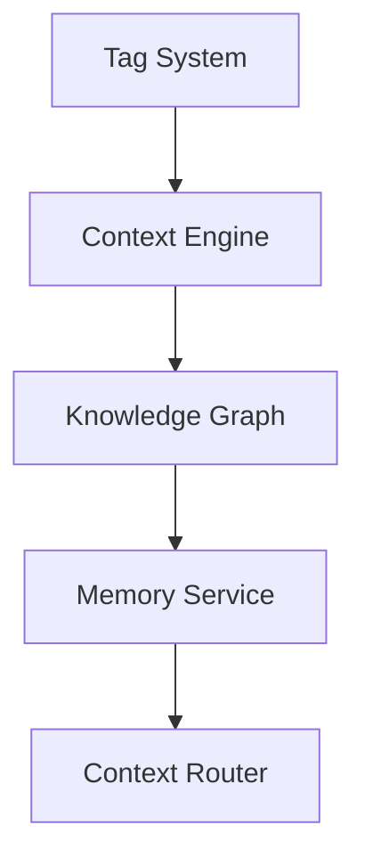

# Ollama Ecosystem: Contextual Awareness Engine

The Contextual Awareness Engine is a core component of the Ollama Ecosystem, built on top of the Tag System. It enables AI models to maintain contextual awareness across interactions, improving response quality and reducing context loss.

## Architecture Overview

The Contextual Awareness Engine builds a dynamic knowledge graph through the tag system and the Knowledge Graph MCP Server integration:



## Key Components

### 1. Context Router

The Context Router is the main entry point for applications integrating with the Contextual Awareness Engine:

```typescript
import { ContextRouter } from "t2p/dist/utils/context-router.js";

// Initialize router
const contextRouter = new ContextRouter({
  applicationId: "ollamavoice", // Identifies the application
  defaultModel: "llama3", // Default model to use
  memoryCacheSize: 100, // Number of context entries to cache
  cacheExpiryMs: 300000, // Cache expiry time (5 minutes)
});
```

### 2. Memory Service

The Memory Service handles communication with the Knowledge Graph MCP Server:

```typescript
interface MemoryServiceConfig {
  serverUrl: "http://localhost:3005"; // Default Knowledge Graph server URL
  maxCacheSize: number;
  refreshInterval: number;
}
```

### 3. Tag Service

The Tag Service manages the tag database and tag operations:

```typescript
import { TagService } from "ollama-tag-t2p/tag-service.js";

const tagService = new TagService({
  databasePath: "~/.ollama/tags/tags.json", // Default database path
  autoBackup: true, // Enable automatic backups
});
```

## Integration Methods

### 1. Basic Context Enhancement

Enhance user prompts with contextual information:

```typescript
async function enhancePrompt(userPrompt: string) {
  const contextRouter = new ContextRouter();

  // Get contextual enhancement
  const context = await contextRouter.routeContext(userPrompt);

  // Format enhanced prompt
  const enhancedPrompt = `
  Context Information:
  ${context.insights.join("\n")}
  
  User Query: ${userPrompt}
  `;

  return enhancedPrompt;
}
```

### 2. Learning From Interactions

Continuously improve context by learning from interactions:

```typescript
async function learnFromInteraction(
  userPrompt: string,
  modelResponse: string,
  successful: boolean
) {
  const contextRouter = new ContextRouter();

  // Track the interaction
  await contextRouter.trackInteraction({
    prompt: userPrompt,
    response: modelResponse,
    result: successful ? "success" : "failure",
    tags: extractRelevantTags(userPrompt, modelResponse),
  });
}

// Helper function to extract tags
function extractRelevantTags(prompt: string, response: string) {
  // Your logic to extract relevant tags from prompt and response
  return ["model-llama3", "task-coding"];
}
```

### 3. Context-Aware Model Selection

Select the most appropriate model based on the context:

```typescript
async function getRecommendedModel(userPrompt: string) {
  const contextRouter = new ContextRouter();

  // Analyze request to get recommended model
  const analysis = await contextRouter.analyzeRequest(userPrompt);

  return {
    model: analysis.recommendedModel || "llama3",
    reasoning: analysis.modelSelectionReason,
    confidence: analysis.modelSelectionConfidence,
  };
}
```

### 4. Full Integration Example

A complete example of integrating with Ollama API:

```typescript
import { ContextRouter } from "t2p/dist/utt2puter.js";
import { OllamaClient } from "@ollama/client";

async function enhancedChat(userPrompt: string) {
  const contextRouter = new ContextRouter();
  const ollama = new OllamaClient({
    host: "http://localhost:11434",
  });

  // Step 1: Analyze the request
  const analysis = await contextRouter.analyzeRequest(userPrompt);

  // Step 2: Enhance the prompt with context
  const enhancedPrompt = await contextRouter.routeContext(userPrompt);

  // Step 3: Select the appropriate model
  const modelName = analysis.recommendedModel || "llama3";

  // Step 4: Send enhanced prompt to Ollama
  const response = await ollama.chat({
    model: modelName,
    messages: [{ role: "user", content: enhancedPrompt }],
  });

  // Step 5: Learn from this interaction
  await contextRouter.trackInteraction({
    prompt: userPrompt,
    response: response.message.content,
    result: "success", // Assumes success; implement feedback mechanism
    model: modelName,
    tags: analysis.relevantTags,
  });

  return {
    response: response.message.content,
    model: modelName,
    enhancedWith: enhancedPrompt,
  };
}
```

## CLI Usage

The Contextual Awareness Engine can be accessed through the Ollama Tag CLI:

```bash
# Generate context for a prompt
ollama-tag context "How do I optimize Llama 3 for coding tasks?" --memory

# Track an interaction
ollama-tag track-interaction "User asked about model selection" --tags model-llama3,task-coding --result success

# Get insights about a tag
ollama-tag insights model-llama3 --memory

# View context history
ollama-tag context-history model-llama3 --limit 10
```

## Performance Considerations

### 1. Caching

Implement caching to reduce overhead:

```typescript
// Memory-aware cache implementation
const memoryCache = {
  insights: new Map(),
  relatedTags: new Map(),
  contextRouting: new Map(),
  expiryMs: 5 * 60 * 1000, // 5 minutes
  lastCheckedTimestamps: new Map(),
};

// Example of using cache for context routing
async function getCachedContext(prompt: string) {
  const now = Date.now();
  const cacheKey = createCacheKey(prompt);

  if (
    memoryCache.contextRouting.has(cacheKey) &&
    now - (memoryCache.lastCheckedTimestamps.get(cacheKey) || 0) <
      memoryCache.expiryMs
  ) {
    return memoryCache.contextRouting.get(cacheKey);
  }

  const contextRouter = new ContextRouter();
  const context = await contextRouter.routeContext(prompt);

  memoryCache.contextRouting.set(cacheKey, context);
  memoryCache.lastCheckedTimestamps.set(cacheKey, now);

  return context;
}

// Helper function to create a cache key
function createCacheKey(prompt: string) {
  // Normalize and hash the prompt for caching
  return prompt.toLowerCase().trim().substring(0, 100);
}
```

### 2. Selective Memory Enhancement

Use memory enhancement selectively to reduce overhead:

```typescript
async function shouldUseMemoryEnhancement(prompt: string) {
  // Criteria for using memory enhancement
  const criteria = {
    isComplexQuery: prompt.length > 50,
    containsSpecificTerms: /model|context|memory|learning/i.test(prompt),
    isHighValueInteraction: true, // Your logic to determine high-value interactions
  };

  // Use memory enhancement if at least 2 criteria are met
  return Object.values(criteria).filter(Boolean).length >= 2;
}

async function smartContextRouting(prompt: string) {
  const contextRouter = new ContextRouter();

  // Determine if we should use memory enhancement
  const useMemory = await shouldUseMemoryEnhancement(prompt);

  // Get context with or without memory enhancement
  const context = await contextRouter.routeContext(prompt, { useMemory });

  return context;
}
```

### 3. Batch Learning

For high-volume applications, batch learning operations:

```typescript
// Learning queue
const learningQueue = [];
const BATCH_SIZE = 10;
const BATCH_INTERVAL_MS = 30000; // 30 seconds

// Add to learning queue
function queueLearningInteraction(interaction) {
  learningQueue.push(interaction);

  // Process batch if reached threshold
  if (learningQueue.length >= BATCH_SIZE) {
    processBatch();
  }
}

// Process batch of learning interactions
async function processBatch() {
  if (learningQueue.length === 0) return;

  const batch = learningQueue.splice(0, BATCH_SIZE);
  const contextRouter = new ContextRouter();

  try {
    await contextRouter.trackBatchInteractions(batch);
    console.log(`Processed batch of ${batch.length} interactions`);
  } catch (error) {
    console.error("Failed to process learning batch:", error);
    // Re-queue failed batch with exponential backoff
    setTimeout(() => {
      learningQueue.unshift(...batch);
    }, Math.min(30000, Math.random() * 5000));
  }
}

// Set up interval to process batches
setInterval(processBatch, BATCH_INTERVAL_MS);
```

## Advanced Usage Patterns

### 1. Conversation Memory

Maintain context across a multi-turn conversation:

```typescript
class ConversationManager {
  private contextRouter: ContextRouter;
  private conversations: Map<string, any>;

  constructor() {
    this.contextRouter = new ContextRouter();
    this.conversations = new Map();
  }

  async startConversation(userId: string) {
    const conversationId = `conv_${Date.now()}_${userId}`;
    this.conversations.set(conversationId, {
      userId,
      startTime: new Date(),
      messages: [],
      contextTags: [],
    });
    return conversationId;
  }

  async addMessage(conversationId: string, message: string, isUser: boolean) {
    const conversation = this.conversations.get(conversationId);
    if (!conversation) throw new Error("Conversation not found");

    if (isUser) {
      // Route context for user message
      const context = await this.contextRouter.routeContext(message, {
        previousContext: conversation.contextTags,
      });

      // Update conversation context
      conversation.contextTags = context.relevantTags;

      // Add message with context
      conversation.messages.push({
        content: message,
        isUser,
        timestamp: new Date(),
        context: context,
      });
    } else {
      // Add AI message
      conversation.messages.push({
        content: message,
        isUser,
        timestamp: new Date(),
      });

      // Learn from this AI response
      await this.contextRouter.trackInteraction({
        prompt: conversation.messages[conversation.messages.length - 2].content,
        response: message,
        result: "success",
        tags: conversation.contextTags,
      });
    }

    return conversation;
  }

  getConversationContext(conversationId: string) {
    const conversation = this.conversations.get(conversationId);
    if (!conversation) throw new Error("Conversation not found");

    return {
      messages: conversation.messages,
      contextTags: conversation.contextTags,
    };
  }
}
```

### 2. Context-Aware Workflows

Create workflows that adapt based on context:

```typescript
class ContextAwareWorkflow {
  private contextRouter: ContextRouter;

  constructor() {
    this.contextRouter = new ContextRouter();
  }

  async determineNextStep(userInput: string, currentStep: string) {
    // Get context for user input
    const context = await this.contextRouter.routeContext(userInput);

    // Determine next step based on context and current step
    const nextStep = await this.contextRouter.predictNextStep({
      currentStep,
      userInput,
      contextTags: context.relevantTags,
    });

    return {
      nextStep: nextStep.recommendation,
      confidence: nextStep.confidence,
      reasoning: nextStep.reasoning,
    };
  }

  async executeStep(step: string, userInput: string) {
    // Your workflow execution logic here
    console.log(`Executing step: ${step}`);

    // Learn from this step execution
    await this.contextRouter.trackWorkflowStep({
      step,
      input: userInput,
      result: "success",
    });
  }
}
```

## Troubleshooting

### Common Issues and Solutions

1. **Context Not Being Routed Correctly**

   - Check if the Knowledge Graph MCP Server is running
   - Verify that tags have sufficient descriptive information
   - Ensure context tracking is being called for successful interactions
   - Try using `ollama-tag context "your prompt" --memory --verbose` to see detailed routing information

2. **High Latency with Context Routing**

   - Implement caching for frequent contexts
   - Reduce the depth of related tag traversal
   - Use selective memory enhancement
   - Batch context operations when possible

3. **Knowledge Graph Server Connection Issues**

   - Verify server is running: `node /c/Users/comfy/Projects/mcp-knowledge-graph/dist/index.js --status`
   - Check server logs in the logs directory
   - Restart the server if needed

4. **Learning Not Improving Context Quality**

   - Seed the system with high-quality exemplar interactions
   - Increase the detail in tracked interactions
   - Ensure feedback mechanism correctly identifies successful interactions
   - Use the `--force-learn` flag to emphasize important interactions

## Advanced Configuration

### Memory Service Configuration

```typescript
const memoryService = new MemoryService({
  serverUrl: "http://localhost:3005",
  maxCacheSize: 100,
  refreshInterval: 300000,
});
```

### Context Router Configuration

```typescript
const contextRouter = new ContextRouter({
  applicationId: "ollamavoice",
  defaultModel: "llama3",
  memoryCacheSize: 100,
  cacheExpiryMs: 300000,
  contextQuality: "high", // 'low', 'medium', 'high'
  insightDepth: "detailed", // 'basic', 'standard', 'detailed'
  contextRelevanceThreshold: 0.7, // Minimum relevance score (0-1)
  maxContextTags: 5, // Maximum tags to include in context
  maxInsightsPerTag: 3, // Maximum insights to include per tag
  enableModelRecommendation: true, // Enable model recommendation
  trackingEnabled: true, // Enable interaction tracking
});
```

## Version Compatibility

| Feature               | Ollama Tag CLI Version | Knowledge Graph Version | Node.js Version |
| --------------------- | ---------------------- | ----------------------- | --------------- |
| Basic Context Routing | 1.2.0+                 | 0.3.0+                  | 18.x+           |
| Enhanced Insights     | 1.2.2+                 | 0.3.1+                  | 18.x+           |
| Model Recommendation  | 1.2.5+                 | 0.3.2+                  | 18.x+           |
| Batch Learning        | 1.3.0+                 | 0.4.0+                  | 18.x+           |
| Workflow Integration  | 1.3.2+                 | 0.4.1+                  | 18.x+           |

## Roadmap

Future enhancements planned for the Contextual Awareness Engine:

1. **Multi-model Context Routing**: Route different parts of a prompt to specialized models
2. **Personalized Context Profiles**: Context adaptation based on user preferences and history
3. **Context Visualization**: Visual representation of context relationships
4. **Automated Tag Hierarchy**: Self-organizing tag categories based on usage patterns
5. **Cross-Application Context Sharing**: Share context between different Ollama ecosystem applications
