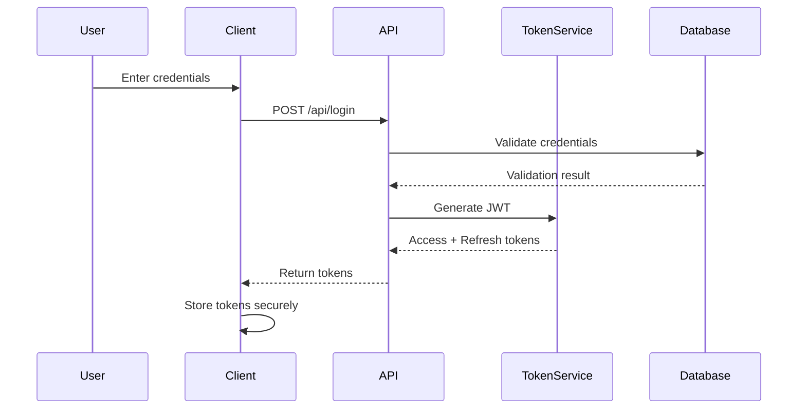

# Documentation Standards Enforcer Demo

This document demonstrates how the Documentation Standards Enforcer Agent will transform non-compliant documentation to match our standardized format.

## Example Transformation: Basic PRD Document

### Before (Non-Compliant)

```markdown
# Feature X

We need to add feature X to the system because users want it.

## Requirements

- It should do A
- It should do B
- It should work with C

## Implementation

We'll use technology Z.
```

### After (Compliant)

```markdown
# Feature X - Product Requirements Document

## Executive Summary

Feature X will enhance the system by providing users with the ability to perform A, B, and integrate with C technology. This feature addresses user demand identified through feedback channels.

## Problem Statement

Users currently need to perform A and B manually while using external tools for C integration. This creates inefficiency and reduces productivity.

## User Stories

- As a user, I want to perform A directly in the system so that I can save time.
- As a user, I want to perform B integrated with my workflow so that I can maintain context.
- As a user, I want C integration so that I can leverage existing data.

## Requirements

### Functional Requirements

- The system shall provide A functionality with parameters for customization.
- The system shall implement B with performance considerations.
- The system shall integrate with C using standard protocols.

### Non-functional Requirements

- Performance: A and B should complete within 500ms.
- Security: C integration must use encrypted connections.
- Usability: Interface should follow existing design patterns.

## Success Metrics

- 80% of users engage with Feature X within 2 weeks of release.
- 50% reduction in time spent on A and B tasks.
- 90% user satisfaction based on survey.

## Implementation Priorities

1. Core A functionality
2. B integration
3. C connectivity
4. Performance optimization

## Out of Scope

- Extended D functionality will be considered for future releases.
- Mobile-specific optimizations will be addressed separately.
```

## Example Transformation: Technical Document

### Before (Non-Compliant)

```markdown
# Auth System

Authentication uses JWT. Users log in with username/password. Store token in localStorage.

## API

/api/login - POST username and password
/api/logout - GET request to invalidate
/api/refresh - POST with refresh token
```

### After (Compliant)

````markdown
# Authentication System - Technical Design Document

## System Overview

The authentication system provides secure user authentication using JSON Web Tokens (JWT). It handles user login, session management, and secure token storage while maintaining compliance with security best practices.

## Architecture Design

The system implements a token-based authentication flow using JWT for stateless authentication:


````

## Component Breakdown

1. **Authentication Controller**: Handles login, logout, and refresh requests
2. **Token Service**: Generates and validates JWTs
3. **User Service**: Manages user data and credentials
4. **Security Middleware**: Validates tokens on protected routes

## Data Models

### User

```typescript
interface User {
  id: string;
  username: string;
  password: string; // Hashed
  email: string;
  roles: string[];
  lastLogin: Date;
}
```

### Token

```typescript
interface Token {
  accessToken: string;
  refreshToken: string;
  expiresIn: number;
}
```

## Interfaces

### REST API

| Endpoint     | Method | Request Body         | Response                               | Description                                           |
| ------------ | ------ | -------------------- | -------------------------------------- | ----------------------------------------------------- |
| /api/login   | POST   | {username, password} | {accessToken, refreshToken, expiresIn} | Authenticates user credentials and returns JWT tokens |
| /api/logout  | POST   | {refreshToken}       | {success: boolean}                     | Invalidates refresh token                             |
| /api/refresh | POST   | {refreshToken}       | {accessToken, refreshToken, expiresIn} | Issues new tokens using refresh token                 |

## Error Handling

- Invalid credentials: 401 Unauthorized
- Invalid token: 401 Unauthorized
- Expired token: 401 Unauthorized with specific error code
- Server errors: 500 Internal Server Error with appropriate logging

## Performance Considerations

- Token validation occurs on every authenticated request
- Use caching for frequent validation operations
- Consider token size for bandwidth optimization

## Security Considerations

- Store tokens in HttpOnly cookies or secure storage
- Implement CSRF protection
- Use short-lived access tokens (15 minutes)
- Use longer-lived refresh tokens (7 days) with secure storage
- Implement token rotation for refresh tokens

## Testing Strategy

- Unit tests for token generation and validation
- Integration tests for authentication flow
- Security testing for token storage and transmission
- Load testing for authentication endpoints

```

## How the Enforcer Agent Works

1. **Analysis**: The agent scans documentation files and identifies their type (PRD, TDD, API, etc.)
2. **Rules Application**: It applies the appropriate template rules to the document
3. **Content Preservation**: All existing content is preserved but reorganized into the correct structure
4. **Section Addition**: Missing required sections are added with placeholder content
5. **Format Correction**: Headers, lists, and other formatting are adjusted to match standards
6. **Validation**: The transformed document is validated against the template requirements
7. **Preview Generation**: A preview of changes is generated for review
8. **Change Application**: Changes are applied either automatically or via PR based on configuration

## Benefits

By automatically enforcing documentation standards, we ensure:

1. Consistent documentation across the entire project
2. Complete documentation with all required sections
3. Improved readability through standardized formatting
4. Better searchability through consistent structure
5. Reduced onboarding time for new team members
6. Higher quality documentation with minimal manual effort
```
