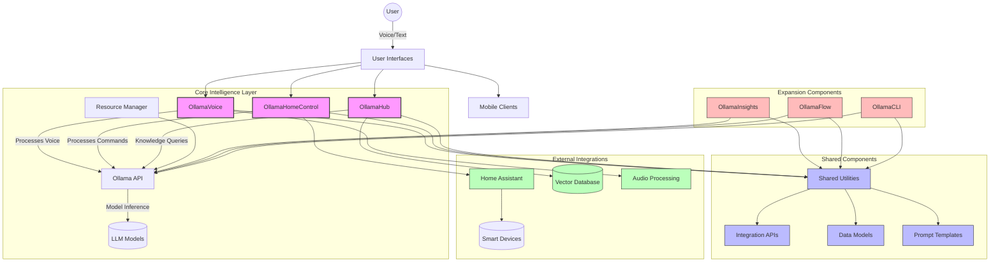
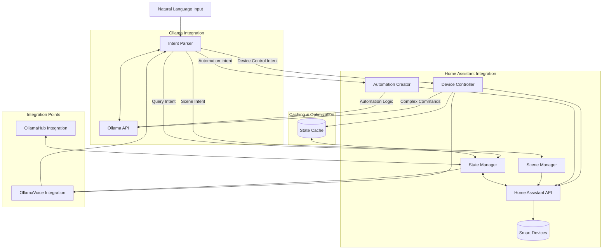
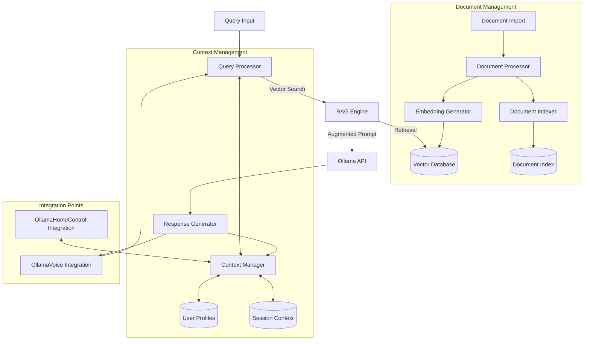
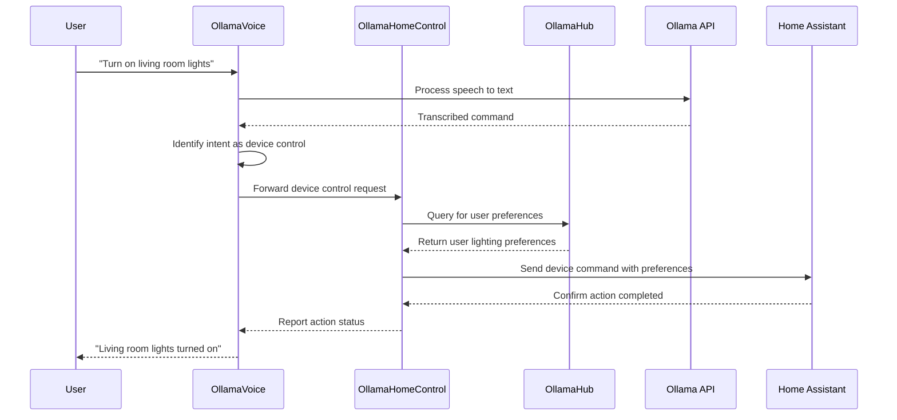
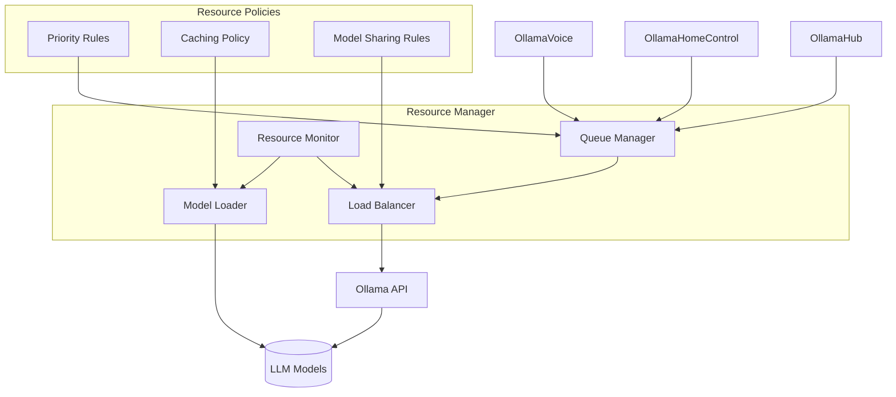
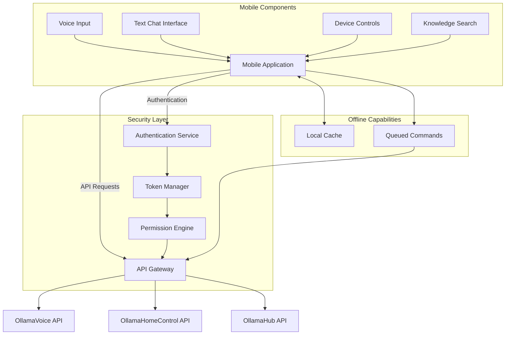
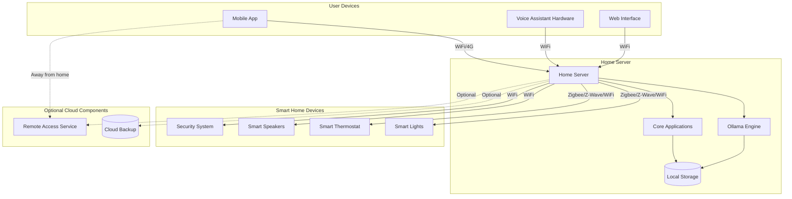
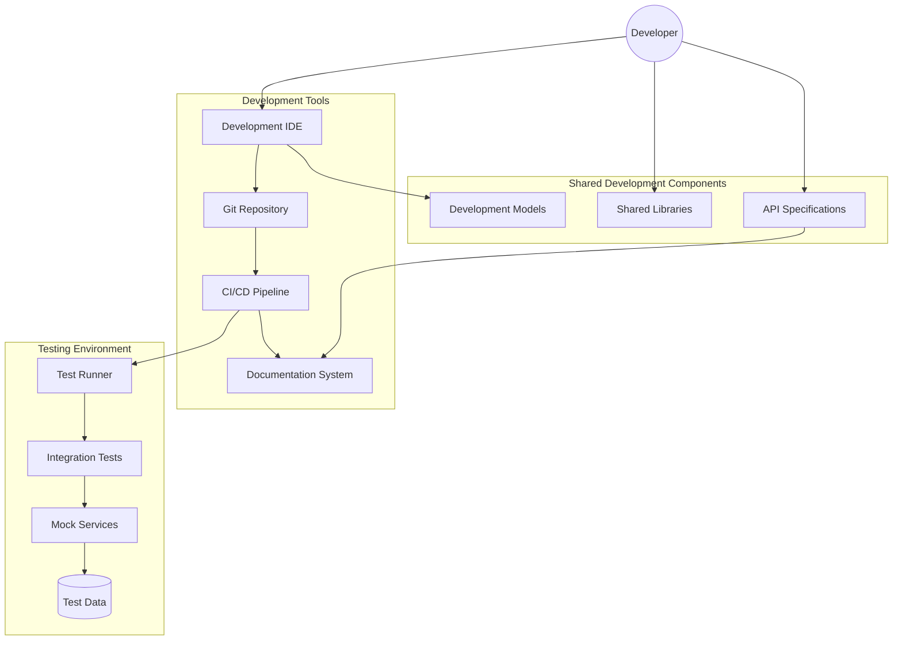

# Ollama Ecosystem Design Schematics

This document provides architectural diagrams and design schematics for the Ollama ecosystem components.

## System Architecture Overview



## OllamaVoice Component Architecture

```mermaid
graph TD
    User((User)) --> |Speaks| MicInput[Microphone Input]
    MicInput --> STT[Speech-to-Text]
    STT --> IntentRec[Intent Recognition]
    IntentRec --> |Prompt Construction| OllamaAPI[Ollama API]
    OllamaAPI --> |Processed Response| ResponseGen[Response Generation]
    ResponseGen --> TTS[Text-to-Speech]
    TTS --> Speaker[Speaker Output]
    Speaker --> User
    
    subgraph "Integration Points"
        IntentRec --> |Command Intent| OHCIntegration[OllamaHomeControl Integration]
        IntentRec --> |Query Intent| OHIntegration[OllamaHub Integration]
        ResponseGen <-- |Knowledge Responses| OHIntegration
        ResponseGen <-- |Device Status| OHCIntegration
    end
    
    subgraph "Memory & Context"
        ConvoContext[Conversation Context]
        ConvoContext --> IntentRec
        ConvoContext --> ResponseGen
        IntentRec --> ConvoContext
    end
```

## OllamaHomeControl Component Architecture



## OllamaHub Component Architecture



## Data Flow Diagram



## Resource Management Architecture



## Mobile Client Architecture



## Integration Points Specification

### OllamaVoice to OllamaHomeControl

```json
{
  "interface_name": "voice_device_control",
  "direction": "OllamaVoice → OllamaHomeControl",
  "request_format": {
    "transcript": "Turn on the living room lights",
    "intent": "device_control",
    "confidence": 0.92,
    "parameters": {
      "device": "living_room_lights",
      "action": "turn_on",
      "modifiers": {
        "brightness": null,
        "color": null
      }
    },
    "context": {
      "user_id": "user_123",
      "location": "living_room",
      "timestamp": "2023-09-15T14:32:10Z"
    }
  },
  "response_format": {
    "status": "success",
    "action_performed": "turn_on",
    "device": "living_room_lights",
    "message": "Living room lights turned on",
    "details": {
      "current_state": {
        "power": "on",
        "brightness": 0.8,
        "color": "warm_white"
      }
    }
  }
}
```

### OllamaHomeControl to OllamaHub

```json
{
  "interface_name": "device_knowledge_query",
  "direction": "OllamaHomeControl → OllamaHub",
  "request_format": {
    "query": "What's the optimal temperature for bedroom at night?",
    "context": {
      "room": "bedroom",
      "time_of_day": "night",
      "current_temperature": 72,
      "user_id": "user_123"
    }
  },
  "response_format": {
    "answer": "Based on sleep research and your preferences, the optimal bedroom temperature at night is between 65-68°F (18-20°C). I've noticed you typically set your bedroom to 67°F before sleep.",
    "confidence": 0.89,
    "sources": [
      {
        "document_id": "sleep_research_2023",
        "relevance": 0.92
      },
      {
        "document_id": "user_preferences",
        "relevance": 0.95
      }
    ],
    "suggested_actions": [
      {
        "action": "set_temperature",
        "parameters": {
          "device": "bedroom_thermostat",
          "value": 67
        }
      }
    ]
  }
}
```

## Physical Deployment Architecture



## Development Environment Architecture

