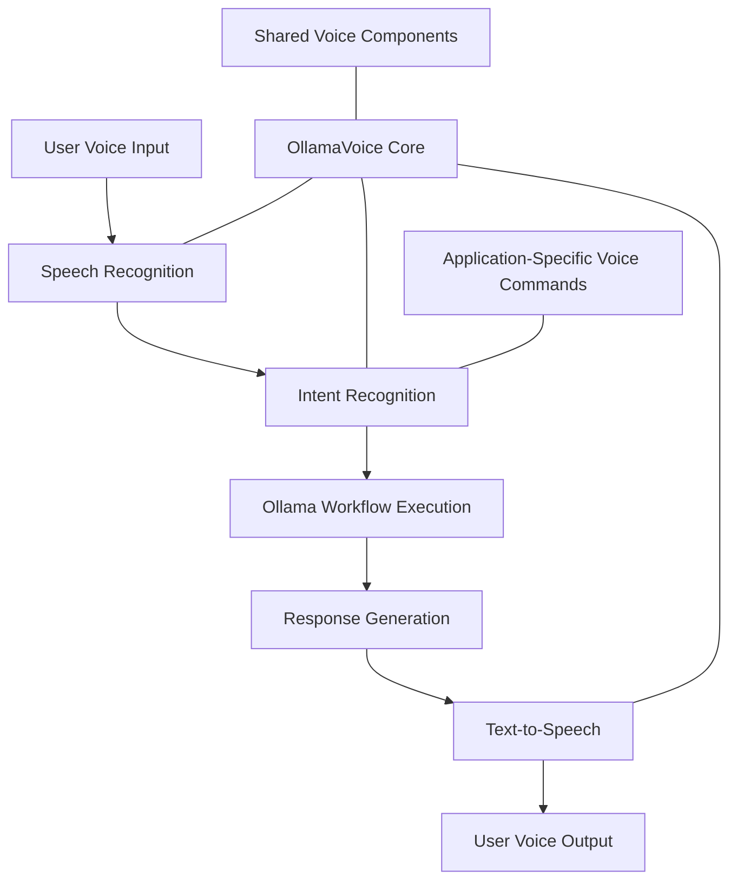
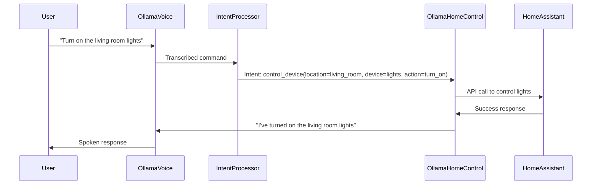
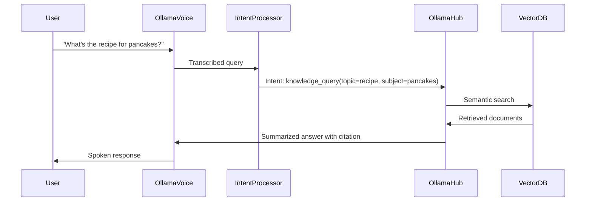

# Voice Integration for Ollama Ecosystem

## Architecture Overview

The voice integration layer will serve as a cross-cutting concern that any Ollama ecosystem application can leverage, following these key principles:



## Core Components

### 1. Speech Recognition Engine

- **Primary Option**: [Whisper](https://github.com/openai/whisper) running locally via Ollama
  - Advantages: Privacy-focused, offline capability, high accuracy
  - Implementation: Python wrapper with WebSocket streaming for real-time transcription

- **Fallback Options**:
  - Browser's Web Speech API for web applications (less privacy, requires internet)
  - Vosk for lightweight offline recognition

### 2. Text-to-Speech Engine

- **Primary Options**:
  - [Piper](https://github.com/rhasspy/piper) - Offline TTS with natural voices
  - [Coqui TTS](https://github.com/coqui-ai/TTS) - Local high-quality voices
  
- **Integration Pattern**:
  - Implement as a service with RESTful and WebSocket APIs
  - Cache common responses for performance
  - Support voice customization per application

### 3. Voice Command Framework

Building on the workflow architecture from ollama-workflows:

```json
{
  "voice_task": {
    "name": "process_voice_command",
    "config": {
      "wake_words": ["hey ollama", "computer", "assistant"],
      "listening_timeout": 10,
      "confidence_threshold": 0.75
    },
    "steps": [
      {
        "name": "listen_for_command",
        "operator": "listen",
        "args": {
          "duration": 5
        },
        "returns": "audio_input"
      },
      {
        "name": "transcribe_command",
        "operator": "transcribe",
        "args": {
          "audio": "$audio_input",
          "model": "whisper"
        },
        "returns": "text_command"
      },
      {
        "name": "detect_intent",
        "operator": "llm",
        "args": {
          "prompt": "Determine the user intent from: $text_command",
          "model": "llama3.2:8b"
        },
        "returns": "intent"
      },
      {
        "name": "route_to_application",
        "operator": "router",
        "args": {
          "intent": "$intent",
          "routes": {
            "home_control": "ollama_home_control_workflow",
            "knowledge_query": "ollama_hub_workflow",
            "assistant": "ollama_voice_workflow"
          }
        },
        "returns": "application_response"
      },
      {
        "name": "speak_response",
        "operator": "speak",
        "args": {
          "text": "$application_response",
          "voice": "en_female_1"
        }
      }
    ]
  }
}
```

## Integration with Existing Components

### OllamaVoice Project Enhancement

The existing OllamaVoice project should be restructured to:

1. Provide core voice services as a standalone package
2. Expose consistent APIs for other ecosystem applications
3. Handle wake word detection and background listening

Implementation details:
- Use Python/FastAPI for the backend service
- WebSocket connections for real-time audio streaming
- Client libraries for JavaScript, Python, and other languages
- Docker container for easy deployment

### Integration with OllamaHomeControl



### Integration with OllamaHub

Voice queries to the knowledge base:



## Implementation Requirements

### 1. Hardware Considerations

- Microphone array for better voice pickup
- Speaker quality for clear responses
- Potential for distributed microphones/speakers throughout home

### 2. Voice Privacy Features

- Local processing of all audio data
- Options to disable wake word listening
- Automatic deletion of voice recordings
- Push-to-talk alternatives for privacy-sensitive scenarios

### 3. Accessibility Features

- Multiple voice options for different preferences
- Speed control for TTS output
- Support for different languages and accents
- Visual feedback alongside voice responses

## Recommended Libraries and Tools

1. **Speech Recognition**:
   - [Whisper.cpp](https://github.com/ggerganov/whisper.cpp) - C++ port of Whisper for efficiency
   - [faster-whisper](https://github.com/guillaumekln/faster-whisper) - Optimized Whisper implementation

2. **Text-to-Speech**:
   - [Piper](https://github.com/rhasspy/piper) - Fast, local neural TTS
   - [Coqui TTS](https://github.com/coqui-ai/TTS) - Open source TTS with multiple voices
   - [Bark](https://github.com/suno-ai/bark) - For more expressive TTS needs

3. **Voice Activity Detection**:
   - [Silero VAD](https://github.com/snakers4/silero-vad) - Efficient voice activity detection
   - [webrtcvad-wheels](https://github.com/wiseman/py-webrtcvad) - Python wrapper for WebRTC VAD

4. **Audio Processing**:
   - [PyAudio](https://github.com/PyAudio/PyAudio) - Cross-platform audio I/O
   - [librosa](https://github.com/librosa/librosa) - Audio processing utilities

## Development Roadmap

### Phase 1: Core Components
- Implement speech recognition service with Whisper
- Develop basic TTS service with Piper
- Create WebSocket API for real-time audio streaming
- Build simple voice command detection

### Phase 2: Integration Layer
- Develop voice intent processor integrated with ollama-workflows
- Create standardized voice command format
- Build client libraries for ecosystem applications
- Implement wake word detection

### Phase 3: Application Integration
- Integrate with OllamaHomeControl for voice smart home control
- Add knowledge query capabilities with OllamaHub
- Develop conversational context management
- Create voice-specific UI feedback components

### Phase 4: Advanced Features
- Multi-user voice recognition
- Continuous conversation capabilities
- Ambient context awareness
- Voice-driven workflow automation

## References

- SPLAA framework: [github.com/cp3249/splaa](https://github.com/cp3249/splaa)
- Ollama Voice demo: [github.com/MikeyBeez/Ollama_Agents](https://github.com/MikeyBeez/Ollama_Agents)
- Whisper integration examples: [github.com/openai/whisper](https://github.com/openai/whisper) 