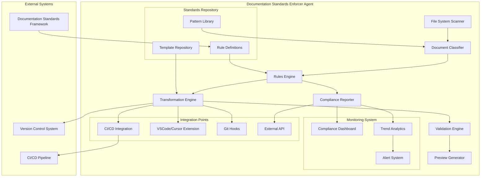

# Documentation Standards Enforcer Agent

## Overview

This high-priority task aims to create an automated agent that scans the entire codebase, identifies documentation that doesn't comply with our Documentation Standards Framework, and automatically corrects or suggests corrections to align all documentation with our established standards.

## Task Details

- **Priority**: P1 (Critical)
- **Horizon**: H1 (Now)
- **Status**: 🔴 Not Started
- **Timeline**: 8-12 days

## Purpose

Automatically ensure all project documentation adheres to our standardized format, structure, and quality guidelines without requiring manual review and correction.

## Implementation Components

### Analysis Phase

- Create file system scanner to identify all documentation files
- Develop pattern matching system for documentation structure validation
- Implement rules engine based on Documentation Standards Framework
- Build reporting system for non-compliant documentation
- Create classification system for documentation types

### Enforcer Module

- Create transformation engine to convert non-compliant docs to standard format
- Implement template application for missing sections
- Build validation system for modified documentation
- Develop preview functionality for changes before application
- Create undo/rollback mechanism for unsuccessful transformations

### Integration Phase

- Create CI/CD integration for automated validation on commits
- Build VSCode/Cursor extension for real-time compliance checking
- Implement automated PR creation for documentation fixes
- Create documentation quality score system
- Add pre-commit hooks for documentation validation

### Monitoring and Reporting

- Develop dashboard for documentation compliance status
- Implement trend analysis for documentation quality over time
- Create scheduled scan and report generation
- Build notification system for newly non-compliant documentation
- Generate actionable insights for documentation improvement

## Implementation Notes

- Use AST-based parsing for Markdown structure analysis
- Implement rule-based transformation engine with pluggable rules
- Create extensible architecture to adapt to evolving documentation standards
- Include manual override capability for edge cases
- Ensure all transformations preserve existing content while reorganizing structure
- Support both automatic fixing and suggestion mode

## Technical Benefits

- Consistent documentation across the entire codebase
- Reduced manual effort in documentation maintenance
- Improved onboarding through standardized documentation
- Higher quality documentation through automated validation
- Automated enforcement of best practices

## Architecture Diagram

## Key Technologies to Consider

- Markdown AST parsers (e.g., remark, unified)
- Template engines for documentation generation
- Git integration for change tracking and PR creation
- CI/CD integration (GitHub Actions, Jenkins)
- VSCode/Cursor extension APIs

## Success Metrics

- > 95% documentation compliance rate across codebase
- Reduction in documentation inconsistencies
- Decreased time spent on manual documentation review
- Improved documentation quality scores
- Positive feedback from team members on documentation usability

## Integration with Existing Systems

- Works with the Documentation Standards Framework
- Integrates with current project structure
- Connects with CI/CD pipeline
- Works with version control system
- Complements existing documentation generation tools

## Template Mapping Strategy

Each identified documentation type will be processed according to a specific template:

- **PRD Documents**: Map to PRD template structure
- **TDD Documents**: Map to TDD template structure
- **PHA Documents**: Map to PHA template structure
- **API Docs**: Map to API specification template
- **User Guides**: Map to user guide template
- **Developer Guides**: Map to developer guide template

## Processing Rules

1. Preserve all existing content through transformation
2. Add required sections if missing
3. Reorganize content into appropriate sections
4. Format headers according to conventions
5. Validate internal document links
6. Check for required metadata
7. Generate table of contents for long documents
8. Insert appropriate diagrams placeholders if missing
9. Ensure consistent terminology
10. Add versioning information if absent
