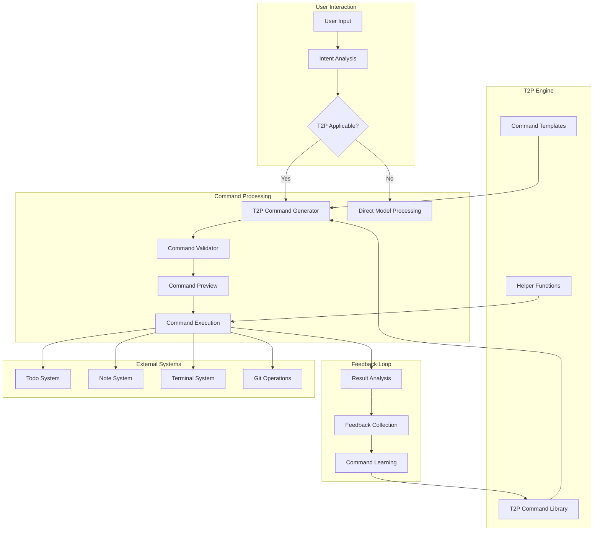

# T2P Engine Integration for AI Model Interactions

## Overview

This high-priority task focuses on integrating our existing t2p (text-to-prompt) engine with AI model interactions to streamline quick tasks and interface operations. By leveraging our prebuilt t2p engine, we can significantly improve efficiency and provide a more consistent experience for common operations.

## Task Details

- **Priority**: P1 (Critical)
- **Horizon**: H1 (Now)
- **Status**: 🔴 Not Started
- **Timeline**: 5-8 days

## Purpose

Utilize our existing t2p engine to enhance AI model interactions for quick tasks, interface operations, and routine functions, reducing repetitive prompting and improving consistency.

## Implementation Components

### Analysis Phase

- Analyze current t2p engine capabilities and extension points
- Identify common model interaction patterns that could benefit from t2p
- Create mapping between natural language commands and t2p operations
- Define criteria for tasks that should use the t2p interface
- Document extension requirements for broader integration

### Integration Phase

- Create adapter layer between model output and t2p command generation
- Implement automatic t2p command suggestion for appropriate tasks
- Develop direct execution pipeline for t2p commands from model output
- Build context-aware command generation based on user history
- Create template system for common operation patterns

### User Experience

- Design clear indicators for when t2p commands are being used
- Implement preview mechanism for t2p command execution
- Create feedback loop for improving command suggestions
- Develop user preferences for automatic vs. prompted execution
- Build help system for available t2p commands

### Testing and Optimization

- Create test suite for t2p command generation accuracy
- Implement performance benchmarks comparing direct vs. t2p execution
- Develop failure recovery for unsuccessful t2p operations
- Create logging system for command usage analytics
- Build optimization system based on usage patterns

## Implementation Notes

- Focus on high-frequency operations first (todo management, note creation)
- Ensure fallback to direct model interaction when t2p commands are insufficient
- Create extensible architecture for adding new command types
- Implement progressive disclosure of complex command options
- Maintain backward compatibility with existing workflows

## Technical Benefits

- Reduced token usage through standardized command structures
- Faster execution of common tasks
- More consistent output formatting
- Improved error handling through standardized approaches
- Better integration with project-specific workflows

## Integration Points

- Connect with model context handling system
- Interface with documentation standards enforcement
- Integrate with project task management
- Link to the horizon planning system
- Interface with conversation memory system

## Success Metrics

- 50% reduction in tokens used for common operations
- 70% of quick tasks successfully handled through t2p
- 90% user satisfaction with suggested commands
- 40% reduction in time for routine operations
- Improved consistency in output formatting

## Task Categories for Integration

### Priority Task Types

1. **Todo Management**

   - Creating new todos with proper metadata
   - Updating todo status and priority
   - Filtering and reporting on todos
   - Managing todo dependencies

2. **Note Operations**

   - Creating structured notes with templates
   - Linking notes to related artifacts
   - Generating summaries and extracts
   - Converting between documentation formats

3. **Interface Interactions**

   - Executing common terminal commands
   - Managing file operations
   - Handling git operations
   - Performing search and replace operations

4. **Project Management**
   - Updating task status in master todo list
   - Creating and assigning new project tasks
   - Generating progress reports
   - Managing priorities and horizons

## Architecture Diagram

