# OSPAiN2 Tech Stack & Infrastructure Mindmap

## 1. Core Architecture 🏗️

```mermaid
mindmap
  root((OSPAiN2 Hub))
    [Development Modes]
      🎨 Design Mode
        UI/UX Development
        Component Architecture
        Visual Systems
      🔧 Engineering Mode
        Core Implementation
        System Integration
        Performance Tuning
      🧪 Testing Mode
        Quality Assurance
        Performance Testing
        Security Validation
      📦 Deployment Mode
        Release Management
        Documentation
        Monitoring Setup
      🔍 Maintenance Mode
        System Health
        Updates
        Support

    [Agent System]
      MicroManager
        Mode Supervision
        Task Validation
        Context Preservation
      TestAgent
        Documentation Testing
        Implementation Testing
        Integration Testing
      CleanupAgent
        Code Analysis
        File Management
        Optimization
      EngineeringAgent
        Code Generation
        Refactoring
        Performance Optimization
      DefaultAgent
        Task Planning
        Documentation
        Testing Support

    [Infrastructure]
      Local-First Systems
        Model Serving Layer
        Cache Management
        Resource Optimization
      Knowledge Graph
        Semantic Analysis
        Context Management
        Relationship Tracking
      Development Tools
        Mode Switcher
        Task Tracker
        Resource Monitor
```


## 2. System Components

### Agent Ecosystem
```typescript
interface AgentSystem {
  microManager: {
    modeSwitching: 't2p m switch <mode>';
    validation: 'Pre/Post transition checks';
    contextPreservation: 'State management across modes';
  };
  specializedAgents: {
    test: 'Documentation, Implementation, Integration';
    cleanup: 'Code analysis and optimization';
    engineering: 'Development and refactoring';
    default: 'Cross-mode support and planning';
  };
  scheduling: {
    automated: 'Cron-based execution';
    eventDriven: 'Trigger-based activation';
    resourceAware: 'Load-balanced distribution';
  };
}
```

### Development Mode Framework
```typescript
interface DevelopmentModes {
  design: {
    focus: 'UI/UX and Architecture';
    tools: ['Component Library', 'Wireframing', 'Prototyping'];
    validation: ['Design Reviews', 'Accessibility Checks'];
  };
  engineering: {
    focus: 'Implementation and Optimization';
    tools: ['Code Generation', 'Performance Tools', 'Debugging'];
    validation: ['Code Reviews', 'Static Analysis'];
  };
  testing: {
    focus: 'Quality and Reliability';
    tools: ['Test Suites', 'Coverage Tools', 'Performance Tests'];
    validation: ['Test Reports', 'Coverage Metrics'];
  };
  deployment: {
    focus: 'Release and Documentation';
    tools: ['CI/CD Pipeline', 'Documentation Gen', 'Monitoring'];
    validation: ['Release Checks', 'Documentation Review'];
  };
  maintenance: {
    focus: 'Health and Support';
    tools: ['Monitoring Tools', 'Support Systems', 'Updates'];
    validation: ['Health Metrics', 'User Feedback'];
  };
}
```

## 3. User Flow & Interaction

### Development Workflow


### Agent Interaction Flow


## 4. Implementation Status

### Current Progress
- UI Component Library: 60% Complete
  - ✅ Core Components: Button, Card, Input, ErrorDisplay
  - ✅ Interactive Elements: Modal, Dropdown, Toast, Tabs
  - 🔄 Navigation: Breadcrumbs, Pagination
  - ⏳ Visualization: Charts, Status Indicators, Timeline

### Knowledge Graph Integration
```typescript
interface KnowledgeGraphMetrics {
  nodes: 248;
  relationships: 612;
  categories: {
    concepts: 86;
    tools: 42;
    files: 57;
    commands: 35;
    agents: 28;
  };
}
```

## 5. Automation & Scheduling

### Agent Scheduling System
```typescript
interface AutomationSystem {
  scheduledTasks: {
    daily: ['Health Checks', 'Backup Verification'];
    weekly: ['Performance Analysis', 'Code Quality Checks'];
    monthly: ['Security Audits', 'Documentation Updates'];
  };
  triggers: {
    onCommit: ['Test Suite', 'Linting'];
    onRelease: ['Documentation Gen', 'Release Notes'];
    onError: ['Error Analysis', 'Recovery Procedures'];
  };
  monitoring: {
    metrics: ['System Health', 'Performance Stats'];
    alerts: ['Error Notifications', 'Threshold Warnings'];
    reporting: ['Status Reports', 'Trend Analysis'];
  };
}
```

## 6. Integration Points

### System Interconnections


## 7. Future Enhancements

### Planned Improvements
1. **Enhanced Mode Transitions**
   - Smoother context preservation
   - Improved validation checks
   - Automated resource optimization

2. **Advanced Agent Capabilities**
   - AI-powered decision making
   - Predictive task management
   - Self-optimizing workflows

3. **Knowledge Graph Evolution**
   - Dynamic relationship mapping
   - Automated insight generation
   - Real-time context updates

4. **UI/UX Advancements**
   - Advanced visualization components
   - Real-time collaboration features
   - Enhanced accessibility support

---
Generated: April 2024
Version: 1.0
Classification: Internal - Strategic 