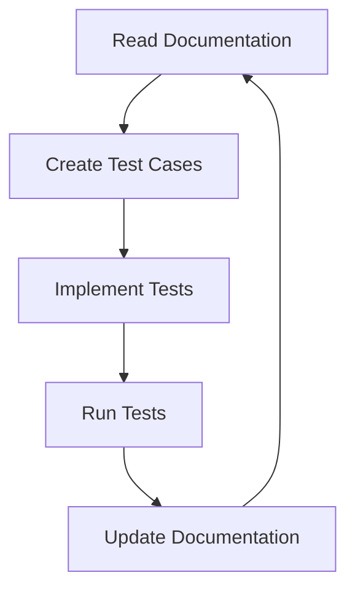
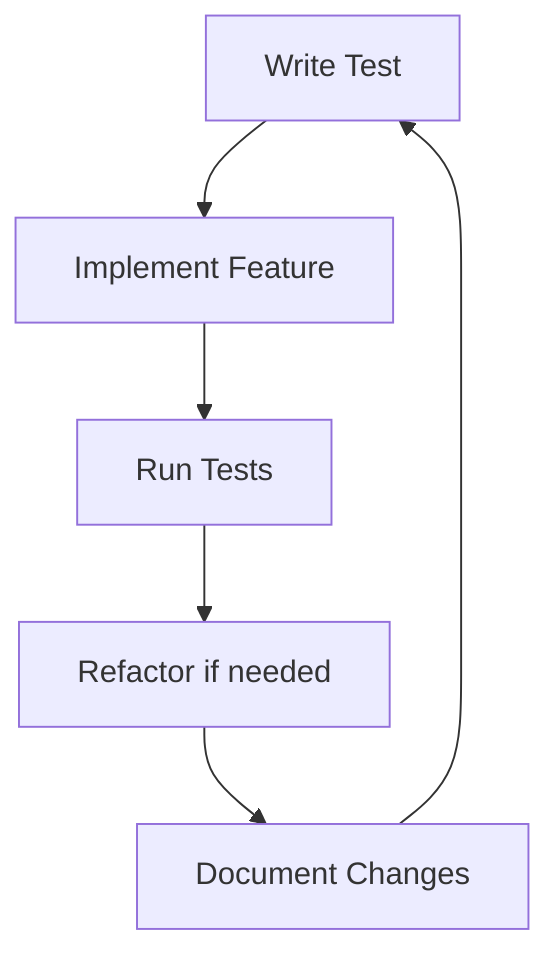
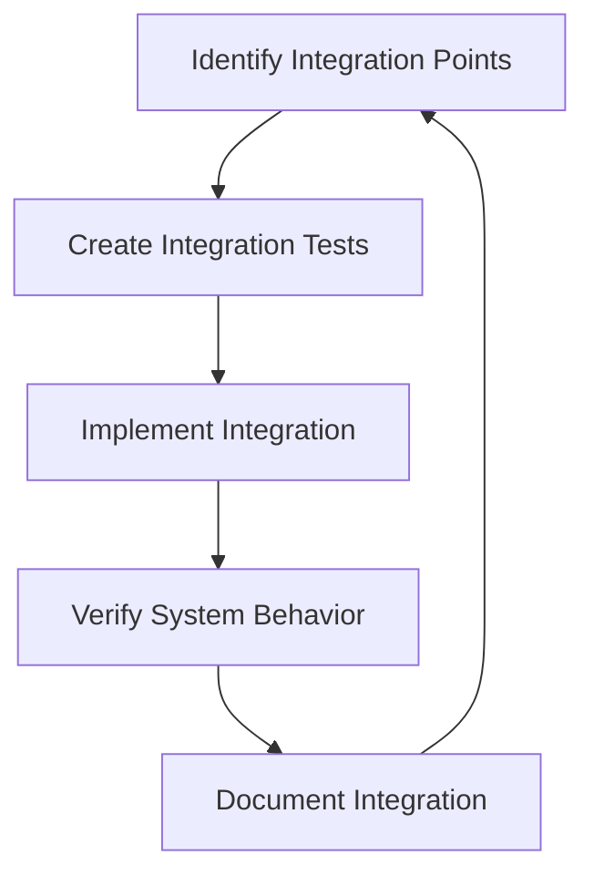

# Test Agents Framework

## Overview

This framework establishes a systematic approach for test agents to work through documentation while developing and testing simultaneously. It combines automated testing, manual verification, and collaborative development practices.

## Agent Types

### 1. Documentation Test Agent

- **Purpose**: Verify documentation accuracy and completeness
- **Responsibilities**:
  - Cross-reference documentation with implementation
  - Identify gaps between docs and code
  - Verify code examples in documentation
  - Test all documented commands and procedures
  - Update documentation based on findings

### 2. Implementation Test Agent

- **Purpose**: Develop and test features simultaneously
- **Responsibilities**:
  - Write tests before implementation (TDD)
  - Implement features with test coverage
  - Verify edge cases and error conditions
  - Document implementation decisions
  - Create integration tests

### 3. Integration Test Agent

- **Purpose**: Ensure system-wide compatibility
- **Responsibilities**:
  - Test component interactions
  - Verify API contracts
  - Test data flow between components
  - Validate error handling across boundaries
  - Document integration patterns

## Workflow

### 1. Documentation Review Cycle

### 2. Development Cycle

### 3. Integration Cycle

## Test Categories

### 1. Unit Tests

- Component-level testing
- Function-level testing
- State management testing
- Error handling testing

### 2. Integration Tests

- API integration testing
- Component interaction testing
- Data flow testing
- Error propagation testing

### 3. End-to-End Tests

- User flow testing
- System-wide feature testing
- Performance testing
- Security testing

## Documentation Verification Checklist

### 1. Technical Documentation

- [ ] API documentation matches implementation
- [ ] Code examples are tested and working
- [ ] Configuration options are documented
- [ ] Error handling is documented
- [ ] Performance considerations are noted

### 2. User Documentation

- [ ] Installation instructions are verified
- [ ] Usage examples are tested
- [ ] Troubleshooting guides are accurate
- [ ] UI/UX documentation matches implementation
- [ ] Accessibility guidelines are followed

### 3. Development Documentation

- [ ] Build process is documented and tested
- [ ] Testing procedures are verified
- [ ] Deployment process is documented
- [ ] Development environment setup is tested
- [ ] Contributing guidelines are accurate

## Collaboration Guidelines

### 1. Communication

- Daily status updates
- Weekly progress reviews
- Issue tracking and resolution
- Knowledge sharing sessions

### 2. Code Review

- Test coverage requirements
- Documentation updates
- Code quality standards
- Performance considerations

### 3. Documentation Review

- Technical accuracy
- Completeness
- Clarity and readability
- Examples and use cases

## Implementation Plan

### Phase 1: Setup (Week 1)

1. Create test agent framework
2. Set up automated testing infrastructure
3. Establish documentation verification process
4. Create collaboration channels

### Phase 2: Initial Testing (Week 2)

1. Begin documentation review
2. Implement basic test suite
3. Identify critical gaps
4. Create test coverage baseline

### Phase 3: Development (Week 3+)

1. Parallel development and testing
2. Continuous documentation updates
3. Integration testing
4. Performance optimization

## Success Metrics

### 1. Test Coverage

- Unit test coverage > 80%
- Integration test coverage > 70%
- End-to-end test coverage for critical paths

### 2. Documentation Quality

- All code examples verified
- No broken links
- Complete API documentation
- Clear troubleshooting guides

### 3. Development Efficiency

- Reduced bug count
- Faster feature implementation
- Improved code quality
- Better collaboration

## Tools and Resources

### 1. Testing Tools

- Jest for unit testing
- Cypress for E2E testing
- React Testing Library
- Custom test utilities

### 2. Documentation Tools

- Markdown linters
- Documentation generators
- Code example testers
- Link checkers

### 3. Collaboration Tools

- Issue tracking
- Code review system
- Documentation review process
- Communication channels

## Next Steps

1. Set up automated test runners
2. Create documentation verification scripts
3. Establish collaboration channels
4. Begin systematic testing process
5. Document findings and improvements
