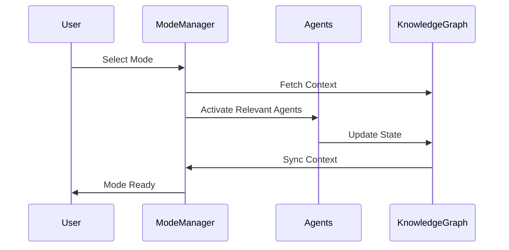
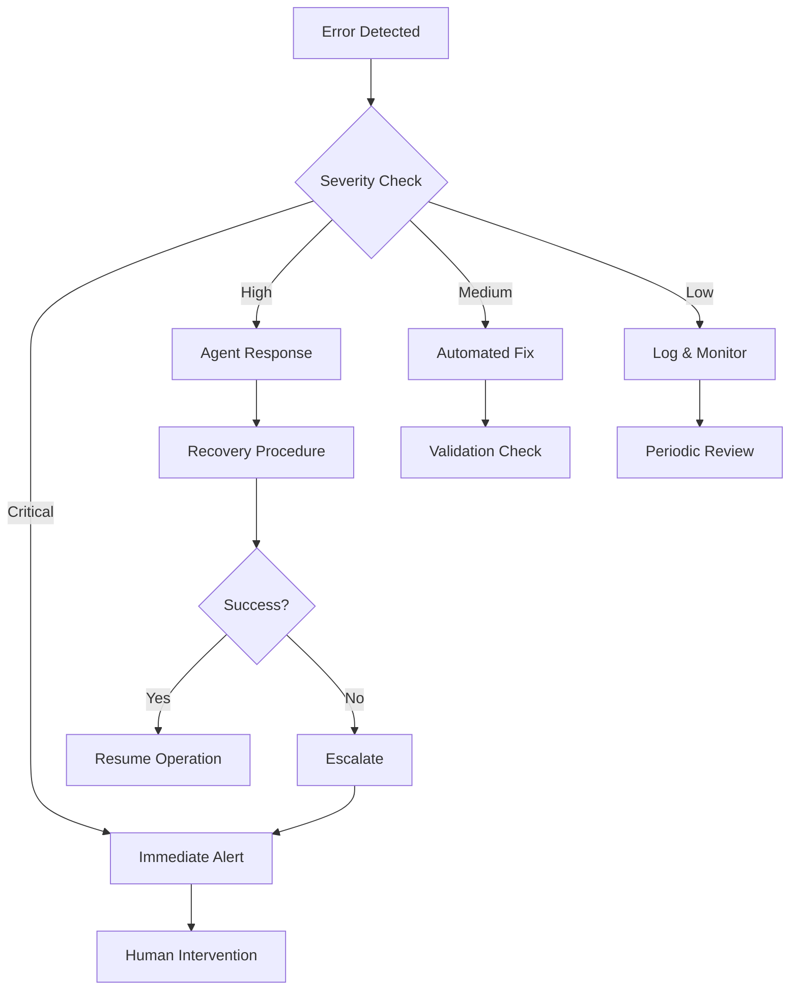

# OSPAiN2 User Application Flow Documentation

## 1. System Overview

### Core Components
- **Development Mode Manager**: Handles mode transitions and context preservation
- **Agent System**: Manages specialized agents for different tasks
- **Knowledge Graph**: Stores and manages relationships between components
- **UI Layer**: Provides user interface for system interaction
- **Automation System**: Handles scheduled tasks and triggers

## 2. User Interaction Patterns

### Mode-Based Development


### Task Execution Flow
```typescript
interface TaskFlow {
  initiation: {
    command: 't2p task create';
    parameters: {
      mode: DevelopmentMode;
      priority: 1 | 2 | 3 | 4 | 5;
      horizon: 'H1' | 'H2' | 'H3';
      description: string;
    };
  };
  execution: {
    validation: 'Pre-execution checks';
    monitoring: 'Progress tracking';
    completion: 'Success verification';
  };
  contextManagement: {
    preservation: 'State backup';
    restoration: 'Context recovery';
    synchronization: 'Multi-agent sync';
  };
}
```

## 3. Workflow Patterns

### Development Mode Transitions
1. **Design Mode Entry**
   ```bash
   t2p m switch design "Starting UI component development"
   ```
   - Activates UI/UX tools
   - Loads component templates
   - Initializes design validation

2. **Engineering Mode Entry**
   ```bash
   t2p m switch engineering "Implementing core functionality"
   ```
   - Activates development tools
   - Loads code templates
   - Initializes testing framework

3. **Testing Mode Entry**
   ```bash
   t2p m switch testing "Validating implementation"
   ```
   - Activates test suites
   - Loads test data
   - Initializes coverage tracking

4. **Deployment Mode Entry**
   ```bash
   t2p m switch deployment "Preparing release package"
   ```
   - Activates build tools
   - Loads deployment configs
   - Initializes documentation gen

5. **Maintenance Mode Entry**
   ```bash
   t2p m switch maintenance "System health check"
   ```
   - Activates monitoring tools
   - Loads health metrics
   - Initializes support systems

## 4. Agent Interaction Guidelines

### MicroManager Commands
```typescript
interface MicroManagerCommands {
  modeControl: {
    switch: 't2p m switch <mode> "<reason>"';
    status: 't2p m current';
    history: 't2p m history';
  };
  taskManagement: {
    create: 't2p task create --priority <1-5> --horizon <H1|H2|H3>';
    list: 't2p task list --status <status>';
    update: 't2p task update <id> --status <status>';
  };
  contextManagement: {
    save: 't2p context save "<description>"';
    restore: 't2p context restore <id>';
    list: 't2p context list';
  };
}
```

### Specialized Agent Interactions
```typescript
interface AgentInteractions {
  testAgent: {
    runTests: 't2p test run --suite <suite>';
    coverage: 't2p test coverage';
    report: 't2p test report';
  };
  cleanupAgent: {
    analyze: 't2p cleanup analyze';
    optimize: 't2p cleanup optimize';
    report: 't2p cleanup report';
  };
  engineeringAgent: {
    generate: 't2p eng generate <template>';
    refactor: 't2p eng refactor <target>';
    optimize: 't2p eng optimize <component>';
  };
}
```

## 5. Automation Schedules

### Daily Tasks
- System health checks (00:00 UTC)
- Backup verification (04:00 UTC)
- Performance metrics collection (12:00 UTC)

### Weekly Tasks
- Code quality analysis (Sunday 00:00 UTC)
- Documentation updates (Saturday 12:00 UTC)
- Performance optimization (Wednesday 04:00 UTC)

### Monthly Tasks
- Security audits (1st day 00:00 UTC)
- Resource optimization (15th day 04:00 UTC)
- Trend analysis (Last day 12:00 UTC)

## 6. Error Handling & Recovery

### Error Response Pattern


### Recovery Procedures
```typescript
interface RecoveryProcedures {
  contextLoss: {
    detection: 'Automated state verification';
    recovery: 'Context restoration from backup';
    validation: 'State consistency check';
  };
  agentFailure: {
    detection: 'Heartbeat monitoring';
    recovery: 'Agent restart procedure';
    validation: 'Capability verification';
  };
  systemOverload: {
    detection: 'Resource monitoring';
    recovery: 'Load balancing';
    validation: 'Performance metrics';
  };
}
```

## 7. Best Practices

### Command Usage
1. Always provide descriptive reasons for mode switches
2. Use appropriate priority levels for tasks
3. Maintain consistent naming conventions
4. Document context changes
5. Verify task completion

### Context Management
1. Save context before major changes
2. Restore context when switching tasks
3. Verify context consistency
4. Document context dependencies
5. Clean up unused contexts

### Error Handling
1. Check error severity
2. Follow recovery procedures
3. Document error patterns
4. Update error handling
5. Monitor recovery success

## 8. Quick Reference

### Common Commands
```bash
# Mode Management
t2p m switch <mode> "<reason>"
t2p m current
t2p m history

# Task Management
t2p task create --priority <1-5> --horizon <H1|H2|H3>
t2p task list --status <status>
t2p task update <id> --status <status>

# Context Management
t2p context save "<description>"
t2p context restore <id>
t2p context list

# Agent Interaction
t2p test run --suite <suite>
t2p cleanup analyze
t2p eng generate <template>
```

### Status Codes
- 🟢 Success: Operation completed
- 🟡 Warning: Operation completed with issues
- 🔴 Error: Operation failed
- 🔵 Info: Operation in progress

---
Generated: April 2024
Version: 1.0
Classification: Internal - Technical 